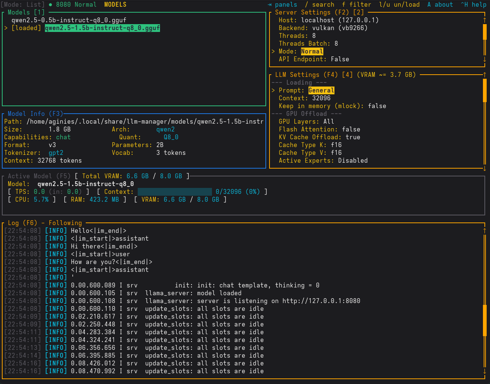

# llm-manager

A terminal UI (TUI) for managing local LLM models with HuggingFace search, download, and inference control.



## Features

- **Search models** on HuggingFace by name (filters to GGUF models, 70 results per page)
- **Download** GGUF model files with progress tracking (pause/resume with `p`)
- **Load/unload** models via llama.cpp server
- **Local Model Filter** — quickly find models in your list with `f`
- **RPC Workers Manager** — dedicated window to manage distributed inference nodes
- **Chat** with loaded models in the terminal
- **Configure** loading and inference parameters per model
- **GGUF file browser** — list and select specific GGUF files for a model
- **Log panel** — expand/collapse with Enter/Esc, follow mode with `f`
- **About Box** — application info and GPLv3 license link (`A`)
- **HuggingFace URL links** — navigate to model pages from Model Info
- **CmdLine overlay** — full-screen view of the computed llama-server command line (`Ctrl+K`)
- **Export to script** — write the llama-server command to `/tmp/test_llamaserver.sh` from the CmdLine overlay (`e`)
- **Benchmark Tuning** — auto-tune model parameters for optimal performance
- **Profiles** — saved presets of settings for quick switching (`p`)
- **System Prompt Presets** — named system prompts for different use cases
- **Router Mode** — load multiple models simultaneously

## Prerequisites

- Rust toolchain (edition 2024)

## Installation

```bash
git clone https://github.com/aginies/llmtui.git
cd llmtui
cargo build --release
```

## Usage

```bash
cargo run
```

### Build script

A convenience script is included for common operations:

```bash
./build.sh build      # Build (debug)
./build.sh run        # Build and run
./build.sh release    # Release build
./build.sh clean      # Remove build artifacts
./build.sh format     # Format code
./build.sh check      # cargo check
./build.sh test       # Run tests
./build.sh clippy     # Run clippy
```

### Serve mode

Run a model directly with llama-server and expose an OpenAI-compatible API:

```bash
# Serve a model with API proxy on port 49222
./build.sh serve --model /path/to/model.gguf --api-port 49222

# Serve with a settings profile
./build.sh serve --model model.gguf --profile qwen

# Serve with API key authentication (Bearer token)
./build.sh serve --model model.gguf --api-port 49222 --api-key secret
```

The serve command automatically resolves the llama-server binary from the backend-specific directory (`~/.local/share/llm-manager/bin/llama-server-{cpu,vulkan,rocm}-{version}/`) and sets `LD_LIBRARY_PATH` for shared libraries. If the binary is not found, it downloads it from the llama.cpp GitHub releases.

The API proxy forwards requests to the running llama-server instance. Explicitly handled endpoints:

| Endpoint | Method | Description |
|----------|--------|-------------|
| `/v1/chat/completions` | POST | Chat completions (OpenAI) |
| `/v1/completions` | POST | Completions (OpenAI) |
| `/v1/responses` | POST | Responses (Anthropic) |
| `/v1/messages` | POST | Messages (Anthropic) |
| `/v1/messages/count_tokens` | POST | Count tokens (Anthropic) |
| `/v1/embeddings` | POST | Embeddings |
| `/v1/models` | GET | List models |
| `/completion` | POST | Legacy completion |
| `/infill` | POST | Code completion (FIM) |
| `/reranking` | POST | Re-ranking |
| `/tokenize` | POST | Tokenize text |
| `/detokenize` | POST | Detokenize tokens |
| `/apply-template` | POST | Apply chat template |
| `/health` | GET | Health check |
| `/v1/health` | GET | Health check (alias) |
| `/metrics` | GET | Prometheus metrics |
| `/props` | GET/POST | Get/set server properties |
| `/slots` | GET | Slot monitoring |
| `/lora-adapters` | GET/POST | List/load LoRA adapters |
| `/models/load` | POST | Load a model (router mode) |
| `/models/unload` | POST | Unload a model (router mode) |
| `/api/status` | GET | Server status (pid, uptime, loaded models) |

> **Note:** All paths not listed above are automatically proxied to the llama-server instance. New endpoints added to llama.cpp work without any code changes.

### Server Settings

The Server Settings panel (top-right) shows server configuration:

| Setting | Description |
|---------|-------------|
| Host | Bind address — press `↵` to open host picker (lists all network interfaces) |
| Backend | Acceleration backend (cpu / vulkan / rocm / rocm-lemonade / cuda) — shows selected version |
| Threads | CPU threads for generation |
| Threads Batch | CPU threads for batch processing |
| Mode | Server mode — `↵` toggles between Normal, Router, Bench GPU, and BenchTune |
| API Endpoint | Enable API proxy — `↵` toggles (disabled while server is running) |
| RPC Workers | Open the distributed inference manager window — press `↵` |
| API Port | Port for the API proxy server (default: 49222) |

When API Endpoint is enabled, a proxy server starts on port `49222` that forwards requests to the running llama-server instance, exposing the full llama.cpp API (see Serve mode above).

Router mode allows loading multiple models simultaneously. The server starts without a model, then loads via `/load` API. The `Max Concurrent Predictions` setting limits how many models can be loaded at once.

### Profiles

The Profiles panel (`p`) shows saved presets of settings for quick switching. Profiles include both built-in presets shipped with the application and user-defined ones. User profiles can be created (`s`), applied (`↵`), and deleted (`d`).

### System Prompt Presets

The System Prompt Presets panel contains named system prompts for different use cases. Presets support create (`n`), edit (`e`), apply (`↵`), and delete (`d`). During edit, `⌃S` saves and `⎋` cancels.

### Keyboard shortcuts

- `j` / `k` or `↓` / `↑` — Navigate up/down in lists and menus
- `h` / `l` or `←` / `→` — Navigate left/right (e.g., horizontal scroll in README)
- `↵` (Enter) — Load model / Download selected / Expand log / Apply profile / Edit setting
- `f` — Filter local models list / Toggle Follow mode (in Log panel)
- `⎋` (Esc) — Back / Exit search / Collapse log / Clear local filter / Close modals
- `⇥` (Tab) — Switch active panels
- `t` — Switch settings tab / Open tags modal (in LLM Settings)
- `/` — Search models on HuggingFace
- `l` — Load selected model / `u` — Unload selected model
- `A` — About box (license and version info)
- `⌃H` (Ctrl+H) — Show Help overlay
- `⌃K` (Ctrl+K) — Show CmdLine overlay
- `⌃D` (Ctrl+D) — Delete model (with confirmation)
- `⌃L` (Ctrl+L) — Focus Log panel
- `p` — Open Profiles panel / Pause or resume download / Previous Benchmark result
- `n` — New preset (in System Prompt Presets) / Next Benchmark result
- `S` (Shift+s) — Cycle search sort (Relevance/Downloads/Likes/Trending/Created)
- `B` (Shift+b) — Back one page in search results
- `↓` at bottom — Load more search results (infinite scroll)
- `R` (Shift+r) — Fetch README for selected model
- `⌃⌥K` (Ctrl+Alt+K) — Kill llama-server process forcefully
- `g` / `G` — Jump to top/bottom of log panel
- `PageUp` / `PageDown` — Scroll fast in logs, README, and Benchmark Output
- `⌃S` (Ctrl+S) — Save settings for selected model / Save preset
- `⌃R` (Ctrl+R) — Reset LLM settings to defaults
- `⌃E` (Ctrl+E) — Toggle enabled/disabled for specific settings
- `⌃⇟` / `⌃⇞` (Ctrl+PgDn/PgUp) — Jump 10 settings down/up
- `F1`–`F6` — Focus/toggle individual panels (Models, Server, Info, Settings, Active, Log)
- `F9` — Show all panels
- `e` (in CmdLine) — Export command to script
- `c` (in Downloads) — Cancel download
- `Space` — Toggle selection (RPC workers, Benchmark parameters)
- `Alt+M` (in BenchTuneSetup) — Toggle benchmark mode
- `Alt+P` (in BenchTuneSetup) — Edit benchmark prompt
- `Alt+N` (in BenchTuneSetup) — Edit max tokens (n_predict)
- `Alt+I` (in BenchTuneSetup) — Edit iterations per test
- `Alt+C` (in BenchTuneSetup) — Edit chat template kwargs

### GPU Layers cycling

In the LLM Settings panel, the GPU Layers field cycles through three modes with arrow keys:

| Mode | Behavior |
|------|----------|
| Auto | Lets llama.cpp auto-detect based on available VRAM (default) |
| Specific number | Offloads exactly that many layers to GPU |
| All | Offloads all layers (equivalent to `-ngl 999`) |

Arrow keys cycle: `Auto` → `1` → `2` → ... → `N` → `All` → `Auto`. Pressing `↵` from a specific number opens an edit buffer for direct input.

### MTP (Multi-Token Prediction)

MTP is an experimental feature that uses a draft model to predict multiple tokens in parallel, improving inference speed. When a model with MTP architecture is selected, the app automatically detects it and enables the `--draft-mtp` flag. The number of draft tokens is read from the GGUF metadata and displayed in the Model Info panel.

### Log panel modes

The Log panel supports two modes:

| Mode | Behavior |
|------|----------|
| **Following** (default) | Auto-scrolls to the bottom as new log entries arrive. Press `g` to exit. |
| **Manual** | Allows manual scrolling through log history. Press `G` to return to bottom and re-enable following. |

Press `f` in the Log panel to toggle between modes. The current mode is displayed in the panel title (e.g., "Log (F6) - Following" or "Log (F6) - Manual"). PageUp/PageDown keys scroll 15 lines at a time.

### Panels

The app has several panels that can be toggled visible or hidden:

| Panel | Description |
|-------|-------------|
| **Models** | Left panel: local model list, search results, download progress |
| **Server Settings** | Server configuration (host, backend, threads, mode, API) |
| **Model Info** | GGUF metadata: architecture, parameters, tokenizer, VRAM estimate |
| **LLM Settings** | Loading, GPU, evaluation, sampling, and repetition parameters |
| **Active Model** | Real-time metrics: TPS, context usage, CPU/RAM/VRAM, benchmarking state |
| **Log** | Server log with expand/collapse and level coloring |
| **Profiles** | Saved presets of settings for quick switching |
| **System Prompt Presets** | Named system prompts for different use cases |
| **README** | Markdown-rendered documentation for HuggingFace models |
| **Downloads** | Download progress with pause/resume and cancel |

Panels can be individually toggled on/off via `F1`–`F6` (Models=1, ServerSettings=2, ModelInfo=3, LlmSettings=4, ActiveModel=5, Log=6). Press `F9` to show all panels. When a panel is hidden, other panels expand to fill the space.

### Search features

| Feature | Description |
|---------|-------------|
| **Sort cycling** | `S` key cycles through Relevance, Downloads, Likes, Trending, Created |
| **Pagination** | `B` key goes back one page; `Down` at bottom loads more results (infinite scroll) |
| **README viewing** | `R` fetches and displays the model's README from HuggingFace; `Enter` expands to fullscreen |
| **README horizontal scroll** | `h`/`l` keys scroll horizontally |
| **README rendering** | Full markdown renderer with headings, code blocks, lists, blockquotes, tables, and task lists |

### Backend selection

Multiple backends are supported via the llama.cpp server:

| Backend | Source | Description |
|---------|--------|-------------|
| **CPU** | [ggml-org/llama.cpp](https://github.com/ggml-org/llama.cpp) | CPU-only inference (standard) |
| **Vulkan** | [ggml-org/llama.cpp](https://github.com/ggml-org/llama.cpp) | GPU via Vulkan (Universal: AMD/NVIDIA/Intel) |
| **ROCm** | [ggml-org/llama.cpp](https://github.com/ggml-org/llama.cpp) | GPU via ROCm (AMD Native) |
| **ROCm Lemonade** | [lemonade-sdk/llamacpp-rocm](https://github.com/lemonade-sdk/llamacpp-rocm) | GPU via ROCm (AMD Optimized, auto-detects GFX architecture) |
| **CUDA** | [ai-dock/llama.cpp-cuda](https://github.com/ai-dock/llama.cpp-cuda) | GPU via CUDA (NVIDIA Native, CUDA 12.8) |

### Server modes

| Mode | Description |
|------|-------------|
| **Normal** | Single model via CLI (default) |
| **Router (XP!)** | Multiple models via API, loads via `/load` endpoint |
| **Bench GPU** | GPU benchmarking mode |
| **BenchTune** | Parameter auto-tuning mode |

### Benchmark Tuning

The Benchmark Tuning system auto-tunes model parameters for optimal performance. Two modes are available:

- **RuntimeOnly**: Single server, params sent in request body (no server restarts)
- **Full**: New server spawned for each parameter combination

Tunable parameters: temperature (0.4-1.0), top_p (0.8-1.0), top_k (40-50), repeat_penalty (1.0-1.2), flash_attn (0/1), threads (4-16), batch_size (512-2048), expert_count (1-4).

Results can be exported as Markdown table, JSON, YAML, or HTML report with summary cards, winner section, impact analysis, and Chart.js charts.

### RPC Workers

Remote workers for distributed inference. Each worker has a name, IP address, and port (default: 50052). Managed via the dedicated RPC Workers window — add (`n`), edit (`e`), delete (`d`), or toggle selection (`Space`).

### CmdLine overlay

Press `Ctrl+K` to view the full command line that would be executed to start the llama.cpp server. The overlay shows the binary path, model path, and all parameters (threads, context size, GPU layers, temperatures, samplers, etc.) so you can copy or inspect the exact invocation. Note that `-ngl` is only included when GPU Layers is set to a specific number or "All"; in "Auto" mode the flag is omitted so llama.cpp can decide dynamically.

From the CmdLine overlay, press `e` to export the command to `/tmp/test_llamaserver.sh` as a bash script (overwrites if it exists). Press `⎋` to close.

### LLM Settings

The LLM Settings panel (24 fields organized into 6 groups):

**Loading (0-2):** Context length, System prompt preset, Keep in memory (mlock)

**GPU (3-8):** GPU Layers, Flash Attention, KV Cache Offload, Cache Type K, Cache Type V, Active Experts

**Evaluation (9-11):** Eval Batch, Unified KV, Max Concurrent Predictions

**Sampling (12-17):** Seed, Temperature, Top-k, Top-p, Min P, Max Tokens

**Repetition (18-21):** Repetition Penalty, Rep. Last N, Presence Penalty, Frequency Penalty

**Backend (22-23):** Tags (semicolon-separated), LLama.cpp Version (per-backend: CPU / Vulkan / ROCm / ROCm Lemonade / CUDA)

**Additional settings:** threads_batch, batch_size, ubatch_size, parallel, keep, swa_full, mmap, numa (None/Distribute/Isolate/Numactl), reasoning_mode (Default/Gemma), split_mode (None/Layer/Row/Tensor), tensor_split, main_gpu, fit, embedding, expert_count, jinja, chat_template, chat_template_kwargs, typical_p, mirostat (Off/1/2), mirostat_lr, mirostat_ent, ignore_eos, samplers (semicolon-separated order), repeat_penalty, repeat_last_n, presence_penalty, frequency_penalty

**Cache Type K/V options:** F32, F16, BF16, Q8_0, Q5_0, Q5_1, Q4_0, Q4_1, Iq4Nl

**Dirty tracking:** Modified fields are shown in yellow with a trailing `*`. The status bar shows `*unsaved*` when settings are dirty. Press `⌃S` to save or `⌃R` to reset to defaults.

**VRAM estimate:** The app computes a detailed VRAM estimate based on model size, GPU layers, KV cache, activation overhead, and fixed overhead. The formula accounts for GQA ratio, FlashAttention (0.5x KV cache reduction), unified KV cache, KV cache quantization bytes, activation overhead (8x multiplier), and fixed overhead (3.8% of max VRAM or 500 MiB fallback). The estimate is shown in the LLM Settings title (e.g., "VRAM ~= 8.2 GB").

### GGUF Metadata

The Model Info panel shows parsed GGUF metadata including: architecture, layers, hidden size, context length, attention heads, KV heads, domain, capabilities, quantization, parameters (e.g., "7B", "405B"), tokenizer type, vocabulary size, and max context for VRAM. Metadata is parsed once and cached (debounced by file mtime).

### Active Model Metrics

The Active Model panel shows real-time metrics:

| Metric | Description |
|--------|-------------|
| TPS | Tokens per second (generation speed) |
| Prompt TPS | Inference speed |
| Context usage | Progress bar showing ctx_used/ctx_max |
| CPU% | CPU usage percentage |
| RAM | RAM usage |
| VRAM | GPU memory used/total |
| Total VRAM | Sum of VRAM across all loaded models (in title bar) |

The panel also shows benchmarking state with progress bar and current parameter display when running BenchTune.

### Model Loading

Models load through several phases detected from llama.cpp log output: ServerStarting → LoadingModel → LoadingMeta → LoadingTensors → ServerListening → Complete. During loading, a progress bar shows the phase and details (layers loaded/total, tensor count, VRAM used).

Models have status states: Available, Loading, Loaded, Failed (with error message shown in red, e.g., "OOM", "Router Crash"), and Benchmarking.

### Download Management

Downloads can be paused and resumed by pressing `p` while a download is selected. Press `c` to cancel a download entirely. Download progress shows bytes per second and percentage complete. The Downloads panel shows all active downloads with individual controls.

### Confirmation dialogs

The app uses confirmation dialogs for:
- **Exit** — warns about loaded models
- **Delete** — confirms irreversible deletion
- **Reset** — confirms resetting all LLM settings
- **Unload** — confirms unloading a model via API
- **DeleteBackend** — confirms deleting a backend binary version from disk

### Mouse support

Mouse interactions are supported: clicking on panels to focus them, and scrolling in the log panel, README panel, settings, profiles, and presets panels.

## Configuration

Configuration is stored in the application's config directory (typically `~/.config/llm-manager/`).

### Backend binary resolution

llama-server binaries are stored in `~/.local/share/llm-manager/bin/` with versioned directories:

```
~/.local/share/llm-manager/bin/
├── llama-server-cpu-{version}/llama-server
├── llama-server-vulkan-{version}/llama-server
├── llama-server-rocm-{version}/llama-server
├── llama-server-rocm-lemonade-{version}/llama-server
└── llama-server-cuda-{version}/llama-server
```

Switching versions is instant — no re-download. The binary is automatically downloaded from specialized repositories on first use:

- **CPU, Vulkan, ROCm (Native):** Fetched from [ggml-org/llama.cpp](https://github.com/ggml-org/llama.cpp)
- **ROCm (Lemonade):** Fetched from [lemonade-sdk/llamacpp-rocm](https://github.com/lemonade-sdk/llamacpp-rocm) (ZIP, auto-detects GFX architecture like `gfx1100`)
- **CUDA (NVIDIA):** Fetched from [ai-dock/llama.cpp-cuda](https://github.com/ai-dock/llama.cpp-cuda) (CUDA 12.8 builds)

Per-backend version config:

```yaml
llama_cpp_version_cpu: null
llama_cpp_version_vulkan: null
llama_cpp_version_rocm: null
llama_cpp_version_rocm_lemonade: null
llama_cpp_version_cuda: null
```

## Contributing

Contributions are welcome! Please see [CONTRIBUTING.md](CONTRIBUTING.md) for guidelines on how to report bugs, suggest features, and submit pull requests.

## License

GPLv3
