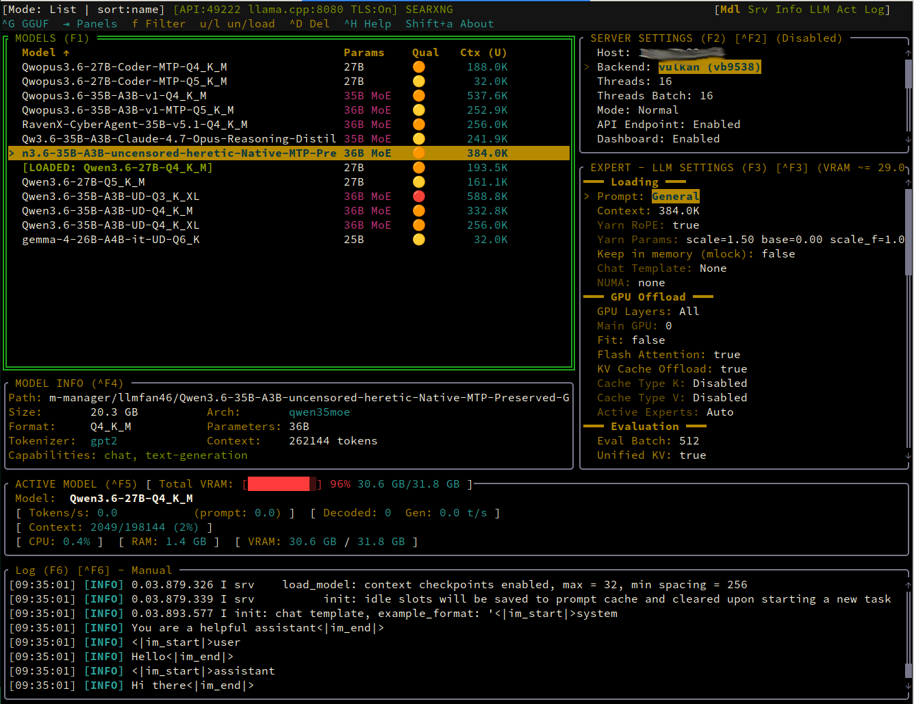

# llm-manager

[](https://github.com/aginies/llmtui/actions/workflows/ci.yml)
[](https://aginies.github.io/llmtui/)
[](https://crates.io/crates/llm-manager)

A terminal UI (TUI) for managing local LLM models with HuggingFace search, download, and inference control.

> **NOTE:** This app is WIP (Work in Progress).



## Features

- Search & download GGUF models from HuggingFace
- Load/unload models via llama.cpp server with real-time metrics
- Chat with loaded models via OpenAI-compatible API proxy
- File Transfer API — send files/directories between servers, with a review agent that runs the local model over the received files
- Pi Orchestrator — a Pi coding-agent extension (`pi-orchestrator/`) that offloads tasks to a remote llama.cpp server, with live streaming, background tasks, and whole-project transfer mode
- Web Chat UI — browser-based chat with conversation history, Markdown, code highlighting, and math rendering
- WebSocket Dashboard — real-time metrics in a web browser
- Benchmark Tuning — auto-tune model parameters for optimal performance
- Profiles & Presets — save and switch between named settings
- Multi-backend — CPU, Vulkan, ROCm, CUDA
- Web Search — SearXNG integration
- Multi-language UI — English, French, Italian, German

## Quick Start

```bash
git clone https://github.com/aginies/llmtui.git
cd llmtui
cargo build --release
cargo run
```

## Documentation

[Full documentation](https://aginies.github.io/llmtui/)

## Pi Orchestrator

`pi-orchestrator/` contains a [Pi](https://github.com/badlogic/pi-mono) coding-agent extension that adds an `orchestrate` tool: it sends a task (optionally with attached files, a git diff, or a whole directory) to a **remote** llama.cpp server and returns the model's answer — sync, async, or streamed live into the tool view.

```bash
# install (global)
cp -r pi-orchestrator/agent/extensions/orchestrator ~/.pi/agent/extensions/
```

Then point it at your server via `~/.pi/orchestrator.json` (or `ORCHESTRATOR_LLAMA_*` env vars):

```json
{
  "llamaUrl": "http://remote-host:8080",
  "llamaModel": "qwen3.8",
  "llamaApiKey": "secret",
  "llamaMaxTokens": 64000,
  "maxPromptLength": 393216,
  "maxFileContent": 131072
}
```

The remote machine **must run llm-manager** — it is the supported server, and it is mandatory for sending and receiving files (the File Transfer API and review agent are llm-manager features). Whole-project reviews (`sendDir`) need the File Transfer API on the remote server: `api_endpoint_enabled` and `api_transfer_enabled` set to `true`, with its `api_endpoint_key` as `llamaApiKey` here.

Full reference: [documentation](https://aginies.github.io/llmtui/pi-orchestrator.html) · [pi-orchestrator/README.md](pi-orchestrator/README.md)

## License

GPLv3
