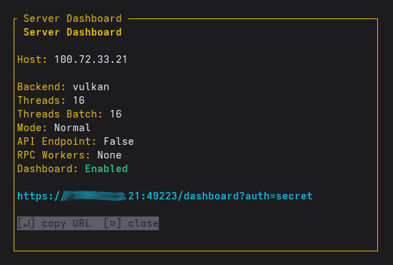

# Configuration

## Directory Layout

llm-manager uses XDG directories for config and data:

```
~/.config/llm-manager/          # Config directory
├── config.yaml                 # Global settings
├── models/                     # Per-model YAML configs
│   └── qwen2.5-7b.yaml
├── profiles/                   # Per-profile YAML configs
│   └── my-profile.yaml
├── presets/                    # Per-preset YAML configs
│   └── custom-preset.yaml
├── unused/                     # Deleted model configs
├── unused_profiles/            # Deleted profiles
└── unused_presets/             # Deleted presets

~/.local/share/llm-manager/     # Data directory
├── models/                     # GGUF model files
│   └── qwen2.5-7b.Q4_K_M.gguf
└── bin/                        # llama-server binaries
    └── llama-server-cpu-...
```

Per-model configs are named `<model_name>.yaml` where `model_name` is the GGUF filename without the `.gguf` extension. Deleted configs are moved to `unused/` subdirectories (recoverable).

## Config File

The main config file is `~/.config/llm-manager/config.yaml`. It is created automatically on first run with sensible defaults.

```yaml
models_dirs:
  - ~/.local/share/llm-manager/models
llama_server: llama-server
default:
  context_length: 131072
  threads: <physical cores>
  threads_batch: 8
  batch_size: 512
  temperature: 0.8
  # ... more settings
```

You can specify a custom config path with `--config`:

```bash
cargo run -- --config /path/to/config.yaml
```

## Default Parameters

| Parameter | Default | Description |
|-----------|---------|-------------|
| `context_length` | 131072 | Context window size in tokens |
| `threads` | (physical cores) | CPU threads for generation |
| `threads_batch` | 8 | CPU threads for batch processing |
| `batch_size` | 512 | Logical maximum batch size |
| `ubatch_size` | 512 | Physical maximum batch size |
| `keep` | 0 | Keep N tokens from initial prompt |
| `mlock` | false | Lock model weights in RAM |
| `mmap` | true | Memory-map the model |
| `kv_cache_offload` | true | Offload KV cache to RAM |
| `flash_attn` | true | Enable Flash Attention |
| `temperature` | 0.8 | Sampling temperature |
| `top_k` | 40 | Top-k sampling |
| `top_p` | 0.95 | Top-p sampling |
| `min_p` | 0.0 | Min-p sampling |
| `typical_p` | 1.0 | Typical-p sampling |
| `repeat_penalty` | 1.1 | Repetition penalty |
| `repeat_last_n` | 64 | Repetition penalty last N tokens |
| `presence_penalty` | null | Presence penalty |
| `frequency_penalty` | null | Frequency penalty |
| `max_tokens` | null | Maximum generation tokens (unlimited if null) |
| `seed` | -1 | Random seed (-1 = random) |
| `backend` | auto-detected | Default backend (auto-detected: Cuda for NVIDIA, Rocm for AMD, Vulkan for Intel; falls back to cpu). Options: `cpu`, `vulkan`, `rocm`, `rocm-lemonade`, `cuda`, `cpu_arm64`, `win_cpu`, `win_vulkan`, `win_cuda_12_4`, `win_cuda_13_1`, `win_hip`, `macos_arm64`, `macos_x64` |

### Advanced Parameters

| Parameter | Default | Description |
|-----------|---------|-------------|
| `swa_full` | false | Full-size SWA cache |
| `numa` | none | NUMA optimization mode |
| `uniform_cache` | true | Unified KV cache across sequences |
| `parallel` | 1 | Max concurrent predictions |
| `max_concurrent_predictions` | null | Max requests in flight |
| `gpu_layers` | -1 | GPU layers (-1 = all) |
| `gpu_layers_mode` | Auto | GPU layers distribution mode |
| `split_mode` | layer | Split mode for multi-GPU |
| `tensor_split` | (empty) | Tensor split across GPUs |
| `main_gpu` | 0 | Main GPU ID |
| `fit` | true | Fit GPU layers automatically |
| `embedding` | false | Enable embedding mode |
| `jinja` | true | Use Jinja chat template |
| `chat_template` | null | Custom chat template string |
| `expert_count` | -1 | Expert count for MoE models |
| `mirostat` | off | Mirostat mode (off, 1, 2) |
| `mirostat_lr` | 0.1 | Mirostat learning rate |
| `mirostat_ent` | 5.0 | Mirostat entropy |
| `ignore_eos` | false | Ignore EOS token |
| `samplers` | penalties;dry;top_n_sigma;top_k;typ_p;top_p;min_p;xtc;temperature | Sampler chain |
| `dry_multiplier` | 0.0 | DRY sampling multiplier |
| `dry_base` | 1.75 | DRY sampling base |
| `dry_allowed_length` | 2 | DRY allowed repetition length |
| `dry_penalty_last_n` | -1 | DRY last N tokens |
| `rope_scaling` | none | RoPE scaling type (none, linear, yarn) |
| `rope_scale` | 1.0 | RoPE scale factor |
| `rope_freq_base` | 0.0 | RoPE frequency base (0 = auto) |
| `rope_freq_scale` | 1.0 | RoPE frequency scale |
| `rope_yarn_enabled` | false | Enable RoPE Yarn |
| `cache_prompt` | true | Cache prompt tokens |
| `cache_reuse` | 0 | Cache reuse length in tokens |
| `cache_type` | f16 | KV cache quantization type |
| `cache_type_k` | null | KV cache quantization type (K) |
| `cache_type_v` | null | KV cache quantization type (V) |
| `spec_type` | (empty) | Speculative decoding type (e.g. "draft-mtp", "ngram-simple") |
| `draft_tokens` | 0 | Number of draft tokens for MTP |
| `host` | 127.0.0.1 | Server bind address |
| `port` | 8080 | Server port |
| `timeout` | 600 | Server timeout in seconds |
| `webui` | false | Enable web UI |
| `ws_server_enabled` | false | Enable WebSocket server |
| `ws_server_port` | 49223 | WebSocket server port |
| `ws_server_auth_key` | null | WebSocket server auth key |
| `ws_server_tls_enabled` | true | WebSocket server TLS |
| `ws_server_tls_cert` | null | WebSocket server TLS cert path |
| `ws_server_tls_key` | null | WebSocket server TLS key path |
| `router_max_models` | 4 | Max models in router mode |
| `server_mode` | Normal | Server mode (Normal, Router, Bench, BenchTune) |
| `api_endpoint_enabled` | false | Enable built-in API endpoint |
| `web_search_enabled` | false | Enable web search |
| `web_search_engine` | searxng | Search engine (searxng) |
| `web_search_engine_url` | (empty) | URL of SearXNG instance (required for web search to work) |
| `web_search_api_key` | null | Bearer token for SearXNG authentication |
| `api_endpoint_port` | 49222 | Built-in API endpoint port |
| `platform` | null | Platform override (linux, windows, macos) |
| `tags` | (empty) | Model tags for filtering |

These can be configured via the LLM Settings panel, per-model config files, or directly in `config.yaml`.

## Profiles

Profiles are named presets of settings. The built-in profiles are:

| Profile | Description | Key Settings |
|---------|-------------|--------------|
| Qwen | Optimized for Qwen models (dense) | temp: 0.7, top-k: 20, presence-penalty: 0.0 |
| Qwen-MoE | Optimized for Qwen MoE models (35B-A3B) | temp: 0.8, top-k: 20, presence-penalty: 1.5 |
| Qwen-Coding | Optimized for Qwen models in coding mode | temp: 0.6, top-k: 20, presence-penalty: 0.0 |
| Gemma | Optimized for Gemma 2/4 models | temp: 1.0, min-p: 0.1, top-k: 65 |
| Llama | Optimized for Llama 3.1/3.3 models | temp: 0.7, top-p: 0.9, repeat-penalty: 1.1 |
| Mistral | Optimized for Mistral 7B/NeMo models | temp: 0.7, top-k: 50, top-p: 0.9 |
| Phi | Optimized for Phi 3.5 Mini models | temp: 0.7, top-k: 50, top-p: 0.9, repeat-penalty: 1.1 |

All profiles also set `context_length: 131072`, `top_p: 0.95`, `max_tokens: 4096`, and `uniform_cache: true`. Qwen, Qwen-MoE, Qwen-Coding, Gemma, Llama, and Mistral also set `jinja: true` (Phi does not).

User-defined profiles are stored as individual YAML files in `~/.config/llm-manager/profiles/<name>.yaml`. Built-in profiles are auto-merged on load.

## System Prompt Presets

System prompt presets define the initial system prompt. Built-in presets:

| Preset | Description |
|--------|-------------|
| General | "You are a helpful assistant." |
| Coder | Expert software developer |
| Thinker | Analytical and thoughtful |
| Mathematician | Expert in mathematics |

The default preset is `Coder`. User-defined presets are stored as individual YAML files in `~/.config/llm-manager/presets/<name>.yaml`. Built-in presets are auto-merged on load.

## Backend Binaries

llama-server binaries are stored in `~/.local/share/llm-manager/bin/` with versioned directories:

```
~/.local/share/llm-manager/bin/
├── llama-server-cpu-{version}/llama-server
├── llama-server-vulkan-{version}/llama-server
├── llama-server-rocm-{version}/llama-server
├── llama-server-rocm-lemonade-{version}/llama-server
└── llama-server-cuda-{version}/llama-server
```

Binaries are downloaded from specialized repositories on first use:

- **CPU, Vulkan, ROCm (Native):** Fetched from [ggml-org/llama.cpp](https://github.com/ggml-org/llama.cpp)
- **ROCm Lemonade:** Fetched from [lemonade-sdk/llamacpp-rocm](https://github.com/lemonade-sdk/llamacpp-rocm) (ZIP, auto-detects GFX architecture like `gfx1100`)
- **CUDA (NVIDIA):** Fetched from [ai-dock/llama.cpp-cuda](https://github.com/ai-dock/llama.cpp-cuda) (CUDA 12.8 builds)

Switching versions is instant — no re-download.

### Per-backend Version Config

```yaml
llama_cpp_version_cpu: null
llama_cpp_version_vulkan: null
llama_cpp_version_rocm: null
llama_cpp_version_rocm_lemonade: null
llama_cpp_version_cuda: null
```

Platform-specific backend variants (e.g. `CpuArm64`, `CpuWindows`, `CpuMacosArm64`) are handled through the `Backend` enum and `platform` field, not through separate version config keys. Each backend has its own independently configurable version.

Setting to `null` uses the latest release. Specific versions can be set via the version picker in LLM Settings. These selections are automatically persisted to your configuration and remembered across restarts.

### Asset Names

Assets are selected based on the detected platform. Linux examples:

- **CPU (x64):** `llama-{tag}-bin-ubuntu-x64.tar.gz`
- **CPU (ARM64):** `llama-{tag}-bin-ubuntu-arm64.tar.gz`
- **Vulkan:** `llama-{tag}-bin-ubuntu-vulkan-x64.tar.gz`
- **ROCm:** `llama-{tag}-bin-ubuntu-rocm-7.2-x64.tar.gz`
- **ROCm Lemonade:** `llama-{tag}-ubuntu-rocm-{gfx}-x64.zip` (auto-detects GPU architecture)
- **CUDA:** `llama.cpp-{tag}-cuda-12.8-amd64.tar.gz`

Windows assets use `*.zip` (e.g. `llama-{tag}-bin-win-cpu-x64.zip`). macOS assets use `llama-{tag}-bin-macos-arm64.tar.gz` or `llama-{tag}-bin-macos-x64.tar.gz`.

## Serve Mode

You can start a model directly from the command line without the TUI:

```bash
./build.sh serve --model /path/to/model.gguf
```

### Options

| Option | Description |
|--------|-------------|
| `--model` | Path to the GGUF model file |
| `--profile` | Apply a settings profile (e.g., `qwen`, `llama`) |
| `--config` | Path to config file |
| `--api-port` | Start API proxy on given port |
| `--api-key` | API key for Bearer token authentication |
| `--ws-enable` | Enable WebSocket dashboard server |
| `--ws-port` | Port for WebSocket dashboard server |
| `--ws-auth` | Auth key for WebSocket dashboard access |
| `--host` | Bind address for the server (e.g., `0.0.0.0`) |
| `--backend-binary` | Path to a custom llama-server binary |
| `--log-file` | Log file path (default: stdout) |
| `--tls-enable` | Enable TLS for WebSocket dashboard |
| `--tls-cert` | Path to TLS certificate file |
| `--tls-key` | Path to TLS private key file |

Note: `--threads`, `--context`, and `--gpu-layers` are not CLI flags. They are configured via `config.yaml` (`default` section) or per-model override files.

### API Proxy

The API proxy forwards requests to the llama.cpp server and provides OpenAI-compatible and Anthropic-compatible endpoints. It supports **SSE (Server-Sent Events) streaming** for chat completions and other streaming endpoints, and **CORS** is enabled for all origins with GET/POST/PUT/DELETE/OPTIONS methods. When `--api-key` is set, all requests require `Authorization: Bearer <key>`.

### API Endpoints

The API proxy explicitly handles the following endpoints, while all other paths are automatically proxied to the llama-server instance:

| Endpoint | Method | Description |
|----------|--------|-------------|
| `/health` | GET | Health check |
| `/metrics` | GET | Prometheus metrics |
| `/v1/chat/completions` | POST | Chat completions (OpenAI) |
| `/v1/completions` | POST | Completions (OpenAI) |
| `/v1/embeddings` | POST | Embeddings |
| `/v1/models` | GET | List models |
| `/api/status` | GET | Server status (pid, uptime, loaded models) |

The following endpoints are forwarded to llama-server (llama-server built-in endpoints, not explicitly handled by llm-manager):

| Endpoint | Method | Description |
|----------|--------|-------------|
| `/v1/responses` | POST | Responses (Anthropic) |
| `/v1/messages` | POST | Messages (Anthropic) |
| `/v1/messages/count_tokens` | POST | Count tokens (Anthropic) |
| `/completion` | POST | Legacy completion |
| `/infill` | POST | Code completion (FIM) |
| `/reranking` | POST | Re-ranking |
| `/tokenize` | POST | Tokenize text |
| `/detokenize` | POST | Detokenize tokens |
| `/apply-template` | POST | Apply chat template |
| `/v1/health` | GET | Health check (alias) |
| `/props` | GET/POST | Get/set server properties |
| `/slots` | GET | Slot monitoring |
| `/lora-adapters` | GET/POST | List/load LoRA adapters |
| `/models/load` | POST | Load a model (router mode, *Work In Progress*) |
| `/models/unload` | POST | Unload a model (router mode, *Work In Progress*) |

## Model Overrides

Settings can be saved per-model. Overrides are stored as individual YAML files in `~/.config/llm-manager/models/<name>.yaml` (where `name` is the GGUF filename without `.gguf`). When a model is loaded, its override settings are merged into the defaults. Deleted configs are moved to `~/.config/llm-manager/unused/` for recovery.

## RPC Workers

You can manage a list of remote `llama-rpc-server` nodes for distributed inference. These are stored in the `rpc_workers` list in the config:

```yaml
rpc_workers:
  - selected: true
    name: "Worker 1"
    ip: "192.168.1.10"
    port: 50052
```

Workers can be managed via the **RPC Workers** window in the **Server Settings** panel. Selected workers are combined into the `--rpc` flag when starting the server.


