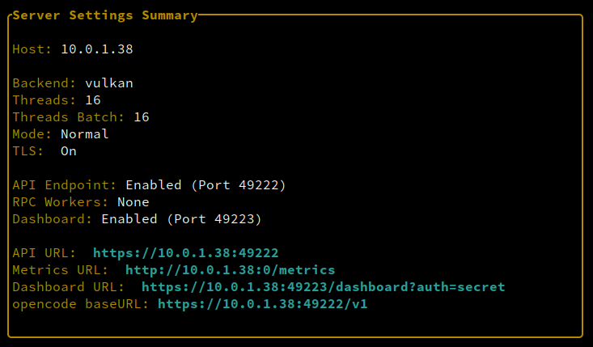

# Dashboard URL Modal

Press `Ctrl+U` in any panel to open the Dashboard URL modal, which copies the WebSocket dashboard URL to your clipboard.

## What It Shows

The modal displays the full dashboard URL including:
- Protocol (`http://` or `https://` if TLS is enabled)
- Host address
- Port (default: 49223)
- Path (`/dashboard`)

> **Note:** The auth key is NOT included in the URL. It is passed via WebSocket subprotocol header during the handshake.

## Use Cases

- Share dashboard access with others
- Paste URL into browser for remote monitoring
- Copy for documentation or tickets

## TLS Support

If the WebSocket dashboard has TLS enabled (configured in Server Settings → Dashboard), the URL uses `https://` instead of `http://`.
