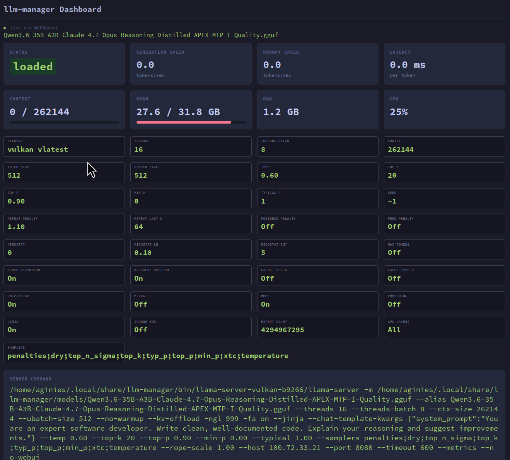

# WebSocket Dashboard

The WebSocket Dashboard provides a real-time visualization of model metrics and settings via a web browser.

## Accessing the Dashboard

The dashboard runs as a built-in HTTP server on port **49223** by default. Open it in your browser:

```
http://localhost:49223
```

## Enabling in Serve Mode

The dashboard can be enabled in serve mode using the `--ws-enable` flag:

```bash
./build.sh serve --model model.gguf --api-port 49222 --ws-enable
```

Customize the dashboard port and authentication:

```bash
./build.sh serve --model model.gguf --api-port 49222 --ws-enable --ws-port 8081 --ws-auth mykey
```

Customize the host and use a specific backend binary:

```bash
./build.sh serve --model model.gguf --api-port 49222 --ws-enable --host 0.0.0.0 --backend-binary /opt/rocm/bin/llama-server
```

The `--host` option controls the bind address for **both** the API proxy server and the WebSocket dashboard server, ensuring they use the same network interface. The default is `127.0.0.1` (from config).

## Enabling in TUI Mode

The dashboard can also be enabled from the TUI:

1. Open the **Server Settings** panel (F2)
2. Navigate to **Dashboard** and press `Enter`
3. Configure:
   - **Enabled** — toggle on/off
   - **Port** — server port (default: 49223)
   - **Auth Key** — optional authentication (see below)
4. Press `Enter` to save, `Esc` to close

## Dashboard Overview

The dashboard displays real-time metrics in a card-based layout:



### Metrics Cards

| Metric | Description |
|--------|-------------|
| **Status** | Current model state (loaded / unloaded / loading) |
| **Generation Speed** | Tokens per second (TPS) for text generation |
| **Prompt Speed** | Tokens per second for prompt processing |
| **Latency** | Milliseconds per token |
| **Tokens** | Tokens generated with progress bar (decoded_tokens / max_tokens, or '∞' if not configured) |
| **VRAM** | GPU memory used/total with color-coded progress bar (green <50%, yellow 50-80%, red >80%) |
| **RAM** | System memory usage |
| **CPU** | CPU usage percentage |

### Settings Panel

Below the metrics, the dashboard shows a grid of current inference settings:

| Setting | Description |
|---------|-------------|
| Backend & Version | llama.cpp backend and version |
| Threads / Threads Batch | CPU thread configuration |
| Context / Batch Size / Ubatch Size | Model execution parameters |
| Temperature / Top-k / Top-p / Min P / Typical P | Sampling parameters |
| Seed | Random seed for reproducibility |
| Repeat Penalty / Repeat Last N | Repetition control |
| Presence Penalty / Frequency Penalty | Advanced repetition control |
| Flash Attention / KV Cache Offload | Performance optimizations |
| Cache Type K / Cache Type V | KV cache quantization |
| Unified KV / Mlock / Mmap | Memory management |
| Expert Count / GPU Layers | Model-specific settings |
| Samplers | Sampler order string |

### Server Command

The full llama-server command line is displayed at the bottom of the dashboard, showing the exact invocation with all parameters. This is useful for debugging and inspecting the exact configuration being used.

## Configuration

To enable and configure the dashboard:

1. Open the **Server Settings** panel (F2)
2. Navigate to **Dashboard** and press `Enter`
3. Configure:
   - **Enabled** — toggle on/off
   - **Port** — server port (default: 49223)
   - **Auth Key** — optional authentication (see below)
4. Press `Enter` to save, `Esc` to close

## Authentication

When an auth key is configured, clients must include it as a query parameter:

```
http://localhost:49223?auth=mysecretkey
```

## Connection Status

The dashboard shows a connection indicator at the top of the page:

- **Green pulsing dot** — Connected via WebSocket
- **Red dot** — Disconnected (auto-reconnects every 2 seconds)

## Architecture

The dashboard server is built with `axum` and `tokio`. It:

1. Creates a `broadcast::channel(64)` for metrics distribution
2. Spawns the server on the configured port
3. Each metrics update is sent to the broadcast channel
4. WebSocket clients subscribe and receive real-time updates
5. The HTML dashboard (embedded in the binary) connects via WebSocket and renders the metrics

The server is started/stopped automatically when you toggle the Dashboard setting in Server Settings.
