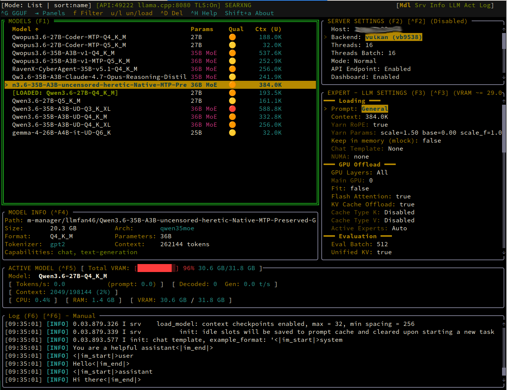
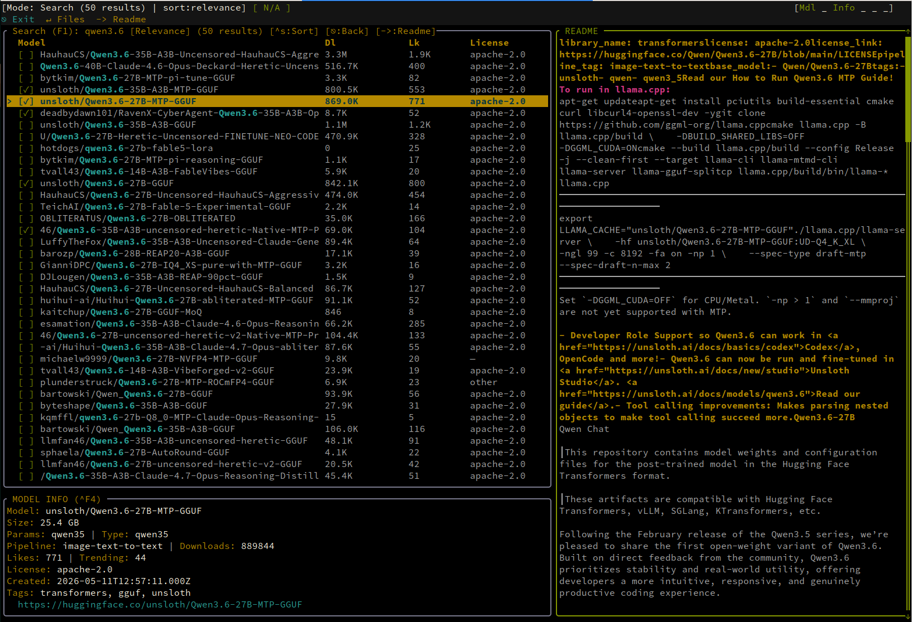
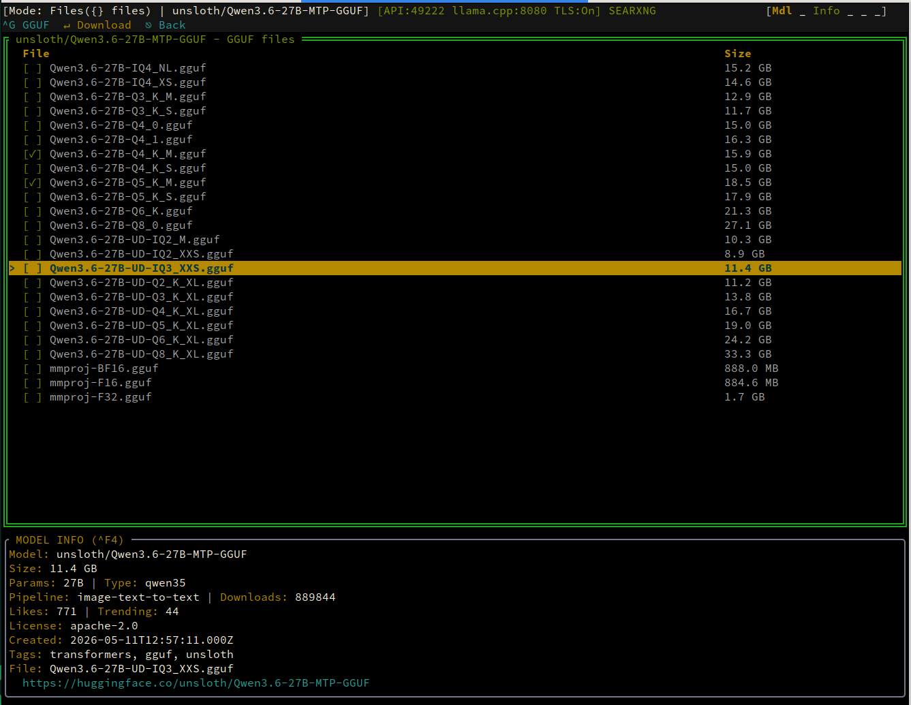
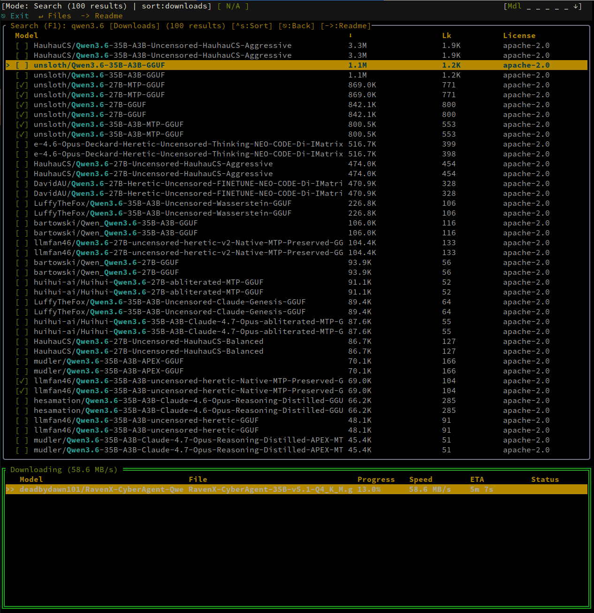
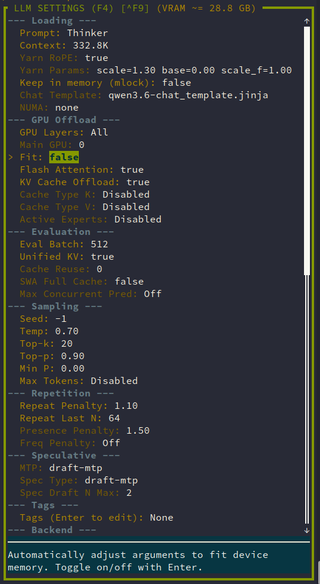
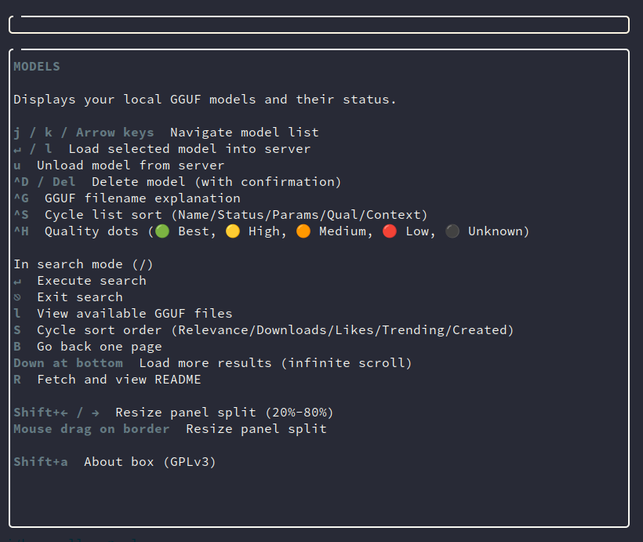

# Getting Started

This guide walks you through installing llm-manager, searching for models, loading one, configuring settings, and connecting a client.

## 1. Install & Start

```bash
git clone https://github.com/aginies/llmtui.git
cd llmtui
cargo build --release
cargo run
```

On first launch, llm-manager creates a default configuration in `~/.config/llm-manager/config.yaml` and sets up the models directory at `~/.local/share/llm-manager/models/`.



## 2. Search & Download Models

Press `/` to enter search mode, type a query (e.g., `qwen2.5`), and press `Enter`.

Results appear sorted by relevance. Press `Ctrl+S` to cycle sort order (Relevance / Downloads / Likes / Trending / Created). Press `Ctrl+B` to go back, or scroll down for more results.



Press `Enter` on a result to browse available GGUF files:



Select a file and press `Enter` to download. The download progress shows speed (MiB/s), ETA, and status. Press `p` to pause/resume, `⌥C` to cancel.

## 3. Load a Model

Once a model is downloaded (or already exists locally):

1. Select the model in the Models panel
2. Press `l` (or `Enter`) to load it

The loading process shows a progress bar with phases: server starting, loading model weights, loading metadata, loading tensors (with GPU layer count), server listening, and ready.

## 4. Configure Settings

Press `F2` to open the **Server Settings** panel. When a server is running, the panel is disabled:



### Server Settings

| Setting | Description |
|---------|-------------|
| **Host** | Bind address (default: `127.0.0.1`) |
| **Backend** | GPU acceleration (auto-detected, or CPU/Vulkan/ROCm/CUDA) |
| **Threads** | CPU threads for generation |
| **Threads Batch** | CPU threads for batch processing |
| **Mode** | Server mode (Normal, Router, Bench, BenchTune) |
| **API Endpoint** | Enable OpenAI-compatible API proxy |
| **Dashboard** | Enable WebSocket dashboard |
| **RPC Workers** | Manage distributed inference nodes |
| **Language** | UI language (en/fr/it) |

Press `F3` to open the **LLM Settings** panel. Toggle expert mode with `Ctrl+X` to reveal 17 additional parameters.



Press `Ctrl+H` for panel-specific help:



### Saving Settings

- `Ctrl+S` — Save settings for the selected model
- `Ctrl+R` — Reset to defaults
- `Ctrl+P` — Apply a profile (built-in: Qwen, Gemma, Llama, Mistral, Phi)

Settings are stored in `~/.config/llm-manager/models/<model_name>.yaml`. For global defaults, edit `~/.config/llm-manager/config.yaml` directly.

## 5. Connect a Client

With the API Endpoint enabled (default port `49222`), you can connect any OpenAI-compatible client:

### curl

```bash
curl http://localhost:49222/v1/chat/completions \
  -H "Content-Type: application/json" \
  -d '{"model":"llama","messages":[{"role":"user","content":"Hello"}]}'
```

With auth key:

```bash
curl http://localhost:49222/v1/chat/completions \
  -H "Authorization: Bearer your-api-key" \
  -d '{"model":"llama","messages":[{"role":"user","content":"Hello"}]}'
```

### opencode

See the [opencode documentation](opencode.md) for configuring opencode to use llm-manager's API endpoint.

### Dashboard

Open the WebSocket Dashboard in your browser:

```
http://localhost:49223
```

See the [Dashboard documentation](dashboard.md) for authentication and TLS configuration.
