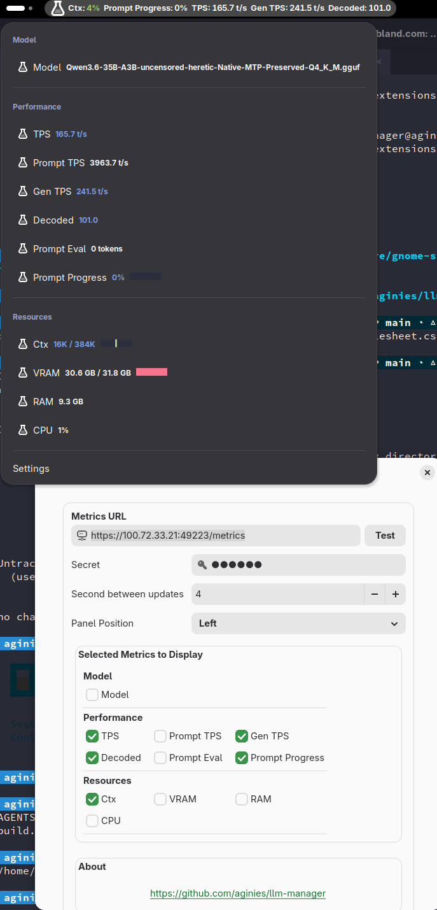

# GNOME Shell Extension

The GNOME Shell Extension provides real-time LLM metrics directly in your GNOME top panel. It connects to a llama.cpp server's WebSocket endpoint and displays key performance indicators without needing a browser.



## Requirements

- GNOME Shell 45, 46, 47, 48, 49, or 50
- A running llama.cpp server with the `/metrics` endpoint (enabled via `--ws-enable` or `--metrics-url`)
- `glib-compile-schemas` (part of `glib-2.0` development packages)

## Installation

### Build the schema

Compile the GSettings schema before installing:

```bash
glib-compile-schemas llm-manager@aginies/schemas/
```

This produces `gschemas.compiled` in the same directory.

### Copy the extension

Copy the extension directory to the GNOME extensions folder:

```bash
cp -r llm-manager@aginies ~/.local/share/gnome-shell/extensions/llm-manager@aginies
```

### Compile the schema in place

Compile the schema for the installed location:

```bash
glib-compile-schemas \
  --strict \
  --directory \
  ~/.local/share/gnome-shell/extensions/llm-manager@aginies/schemas \
  ~/.local/share/gnome-shell/extensions/llm-manager@aginies/schemas/gschemas.compiled
```

### Enable the extension

Activate the extension using the GNOME Extensions CLI:

```bash
gnome-extensions enable llm-manager@aginies
```

Or enable it via the [GNOME Extensions](https://extensions.gnome.org/) application.

### Switch to the extension

After enabling, you may need to reload GNOME Shell:

- On X11: Press `Alt+F2`, type `r`, press `Enter`
- On Wayland: Log out and log back in

## Configuration

### Settings

The extension provides a preferences dialog accessible from the GNOME Extensions application or by right-clicking the extension icon in the panel.

| Setting | Default | Description |
|---------|---------|-------------|
| **Metrics URL** | `http://127.0.0.1:8080/metrics` | HTTP/HTTPS URL of the llama.cpp metrics endpoint. The WebSocket URL is derived from this (path changes to `/ws`, protocol changes to `ws://` or `wss://`). |
| **Update Interval** | 3 seconds | Delay between WebSocket reconnection attempts when disconnected. |
| **Panel Position** | 2 (Right) | Where the extension appears in the panel: `0`=left, `1`=center, `2`=right, `3`=far left, `4`=far right. |
| **WebSocket Auth** | Enabled | Auto-detect and extract the `auth` query parameter from the metrics URL for WebSocket authentication. |

### Testing the Connection

The preferences dialog includes a **Test** button that:

1. Runs `curl -s -I -k --max-time 5 <metrics-url>` against the configured URL
2. Checks for HTTP response headers and LLM server indicators (`llamacpp:` or `# HELP`)
3. Shows success (green) or failure (red) status

### Metrics Selection

Toggle individual metrics on or off via checkboxes in the preferences dialog. All 12 metrics are selected by default. The selected metrics appear both in the top panel (as a compact string) and in the dropdown menu as clickable items.

## Metrics Reference

The extension monitors 12 metrics from the llama.cpp WebSocket feed. Each metric can be individually toggled in the preferences dialog.

| Metric Key | Label | Type | Description |
|------------|-------|------|-------------|
| `model_name` | Model | text | Current model filename (path stripped to basename) |
| `tps` | TPS | number | Tokens per second for generation (t/s) |
| `prompt_tps` | Prompt TPS | number | Tokens per second for prompt processing (t/s) |
| `gen_tps` | Gen TPS | number | Generation tokens per second |
| `ctx` | Ctx | ratio | Context window usage (tokens), displayed with K-suffix (e.g., "2K / 8K") |
| `vram` | VRAM | ratio_gb | GPU memory usage in GB (e.g., "8.0 GB / 24.0 GB") |
| `ram` | RAM | gb | System memory usage in GB |
| `cpu` | CPU | percent | CPU usage percentage |
| `decoded_tokens` | Decoded | number | Total decoded tokens generated |
| `prompt_tokens` | Prompt Eval | number | Prompt evaluation token count |
| `prompt_progress` | Prompt Progress | ratio_pct | Prompt processing progress (0–100%) |

### Context Token Formatting

Context usage is displayed with K-suffix formatting for large values. When the token count exceeds 1024, it is shown as kilotokens (e.g., "2K / 8K" instead of "2048 / 8192"). Smaller values display as raw numbers.

## Color Coding

Metric values and progress bars use color coding to indicate load levels:

| Color | Threshold | Usage |
|-------|-----------|-------|
| **Green** (`#9ece6a`) | < 50% | Normal operation |
| **Yellow** (`#e0af68`) | 50% - 80% | Elevated usage |
| **Red** (`#f7768e`) | > 80% | High usage, approaching limits |

Progress bars for VRAM and context also use these colors. The VRAM progress bar on the panel icon uses the same thresholds.

## WebSocket Authentication

When the **WebSocket Auth** setting is enabled, the extension automatically extracts the `auth` query parameter from the configured metrics URL and passes it to the WebSocket connection. This supports llama.cpp servers that require authentication for the `/ws` endpoint.

Example:

```
Metrics URL: http://127.0.0.1:8080/metrics?auth=mysecretkey
WebSocket URL: ws://127.0.0.1:8080/ws?auth=mysecretkey
```

The auth extraction parses query parameters from the metrics URL and appends `?auth=<value>` to the WebSocket URL when found.

## Panel Display

The extension displays a compact string in the top panel showing each selected metric's label and value, separated by spaces. When no metrics are selected or all selected metrics show no data, the panel icon remains visible with the label hidden.

The dropdown menu shows all metrics as interactive checkboxes. Clicking a metric toggles its selection state. Metrics with progress bar types (ctx, vram) display both a value and a colored progress bar in the menu.

## Recent Changes

- **Prompt Metrics** — Added `prompt_tokens` (Prompt Eval) and `prompt_progress` (Prompt Progress) metrics to the Performance group. Prompt Progress uses a new `ratio_pct` type for progress bars with 0–100% values.
- **Icon Size** — Panel icon increased from 16px to 24px for better visibility
- **Debug Log Removed** — Debug log panel removed from preferences dialog to simplify the settings interface
