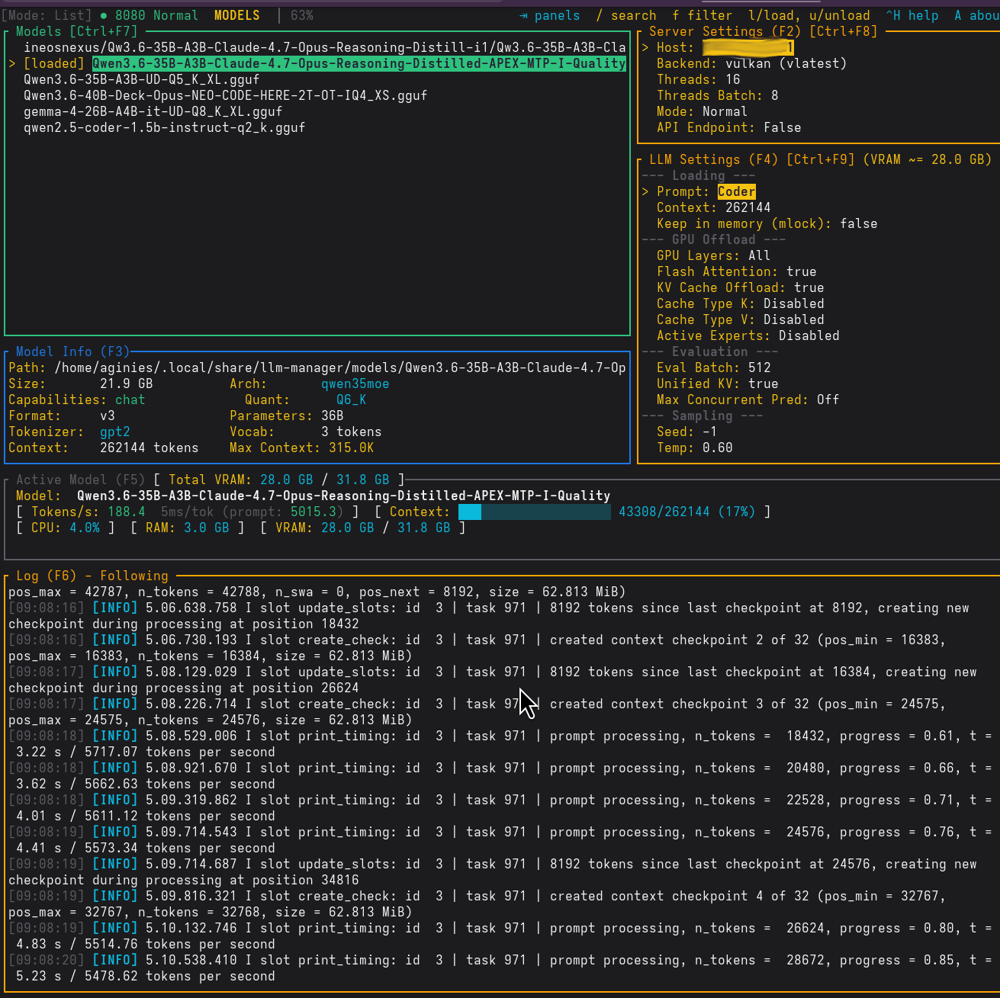

# Introduction

**LLM Manager** is a terminal UI (TUI) for managing local LLM models. It lets you search HuggingFace, download GGUF models, load them via llama.cpp's `llama-server`, and chat with them — all from your terminal.

## Features

- **Model search** on HuggingFace (filters to GGUF models, paginated with infinite scroll)
- **Download** GGUF model files with progress tracking and cancellation (with disk space check)
- **Load/unload** models via llama.cpp server with progress visualization
- **Local Model Filter** — quickly find models in your list with `f`
- **RPC Workers Manager** — dedicated window to manage distributed inference nodes
- **Chat** with loaded models in the terminal
- **Configure** loading and inference parameters per model
- **GGUF file browser** — list and select specific GGUF files for a model
- **Log panel** — expand/collapse with Enter/Esc, follow mode with `f`
- **About Box** — application info and GPLv3 license link (`A`)
- **CmdLine overlay** — view the full llama-server command line (`Ctrl+K`), export to script (`e`)
- **API proxy** — expose an OpenAI-compatible API with CORS and SSE streaming support
- **API key authentication** — Bearer token authentication for the API proxy
- **Profiles** — save and apply named presets of settings
- **System Prompt Presets** — named system prompts for different use cases
- **Router Mode** — load multiple models simultaneously
- **Benchmark Tuning** — auto-tune model parameters for optimal performance
- **Panel Resize** — drag the border between left and right panels, or use `Shift+←/→`
- **README rendering** — full markdown renderer for HuggingFace model documentation
- **HuggingFace URL links** — navigate to model pages from Model Info
- **Multi-backend** — CPU, Vulkan, ROCm, ROCm Lemonade, and CUDA support with per-backend version picker (13 platform-specific variants)
- **Speculative decoding** — MTP and other speculative decoding types via SpecTypePicker
- **Per-model tags** — Edit and manage tags for each model
- **TLS support** — Secure WebSocket dashboard with self-signed certificate generation
- **Dashboard URL modal** — Copy dashboard URL to clipboard with `Ctrl+U`
- **YaRN RoPE** — Extend context beyond training length with YaRN RoPE parameter tuning

## Prerequisites

- Rust toolchain (edition 2024)
- A HuggingFace account (for downloading gated models)
- An NVIDIA GPU (Vulkan/CUDA) or AMD GPU (ROCm/ROCm Lemonade) for GPU inference, or a CPU for CPU-only inference

## Screenshot



## Quick Start

```bash
git clone https://github.com/aginies/llmtui.git
cd llmtui
cargo build --release
cargo run
```
