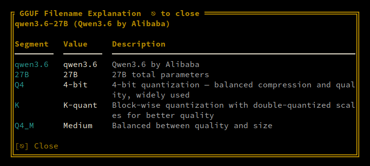
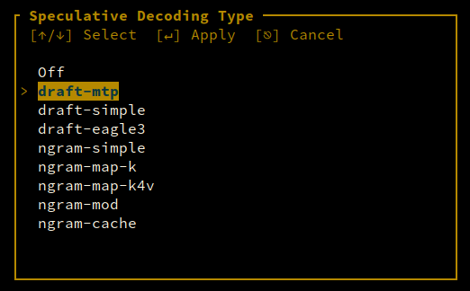

# LLM Settings

LLM Settings cover model parameters and inference configuration.

---

# GGUF Filename Explanation

GGUF filenames encode the model's architecture, quantization, and source. Press `Ctrl+G` from any panel to open a popup that parses and explains the filename.



## How It Works

The parser splits the filename into segments and provides a description for each:

- **Model family** — e.g., "Qwen3.6-35B-A3B", "Llama-3.1-8B"
- **Unsloth Dynamic** — Indicates the model was fine-tuned using Unsloth's dynamic methodology
- **Quantization** — e.g., "Q4_K_M", "Q5_K_S"
- **Extension** — ".gguf"

## Quantization Legend

| Quant | Description |
|-------|-------------|
| Q4_0 | 4-bit quantization (legacy) |
| Q4_K_M | 4-bit mixed quantization (recommended) |
| Q5_K_M | 5-bit mixed quantization |
| Q5_K_S | 5-bit small quantization |
| Q8_0 | 8-bit quantization |
| F16 | Floating-point 16-bit (unquantized) |

## Model Families

The parser recognizes common model families and provides specific explanations:

- **Qwen** — Alibaba's Qwen models (dense and MoE)
- **Llama** — Meta's Llama models
- **Gemma** — Google's Gemma models
- **Mistral** — Mistral AI models
- **Phi** — Microsoft's Phi models
- **And more** — Custom explanations for other architectures

## Auto-Detection of MoE Models

For MoE (Mixture-of-Experts) models, the parser extracts and displays the expert count and parameter breakdown. For example, Qwen3.6-35B-A3B indicates a 35B total parameter model with 3.5B active parameters per token.

## Unsloth Dynamic

When a model has been fine-tuned using Unsloth's dynamic methodology, the filename includes "Unsloth Dynamic". This indicates the model was optimized with Unsloth's dynamic quantization approach, which typically yields better quality at the same quantization level.

---

# Cache

KV cache management for performance optimization.

## Cache Prompt

Controls whether the KV cache is computed and stored for the prompt (input) tokens during generation.

### Configuration

| Setting | Default | Description |
|---------|---------|-------------|
| **Cache Prompt** | true | Whether to cache the prompt tokens in the KV cache |

### How It Works

When enabled (default), the prompt tokens are cached in the KV cache during generation. This means:
- The prompt is only computed once, improving efficiency for repeated prompts
- The KV cache includes both prompt and generation tokens
- More KV cache memory is used

When disabled, the prompt tokens are not cached. This means:
- The prompt is recomputed on every iteration
- Less KV cache memory is used
- Useful for very long prompts where caching would exceed available memory

### When to Disable

- **Very long prompts** — When the prompt is so long that caching it would consume all available KV cache memory
- **Limited VRAM** — When you need to maximize memory for generation tokens
- **Streaming scenarios** — When processing prompts incrementally

### Config Key

`cache_prompt` — boolean, default true.

## Cache Reuse

Controls how many tokens from the KV cache are reused when processing a new prompt that shares prefix context with the previous one.

### Configuration

| Setting | Default | Description |
|---------|---------|-------------|
| **Cache Reuse** | 0 | Number of tokens to reuse from the previous KV cache |

### How It Works

When processing a new prompt that starts with the same text as the previous prompt, the cache reuse feature avoids recomputing the KV cache for the shared prefix. The number specified here is the maximum number of tokens that will be reused.

For example, if the previous prompt was "Hello, how are you today?" and the new prompt is "Hello, how are you today? What's the weather?", setting cache reuse to 8 would reuse the KV cache for the first 8 tokens ("Hello, how are you today") and only compute the new portion.

### When to Use

- **High values** (100+) — When processing many prompts with long shared prefixes (e.g., system prompts + user queries)
- **Low values** (0-16) — When prompts rarely share prefixes, or when you want to minimize memory usage
- **Zero** — Disables cache reuse entirely

### Config Key

`cache_reuse` — integer, default 0.

---

# Speculative Decoding

Speculative Decoding accelerates inference by using a smaller "draft" model to predict multiple tokens, which are then verified by the main model in parallel. This can significantly reduce generation time without sacrificing quality.

## How Speculative Decoding Works

```
Standard Decoding:
  [Token1] → [Token2] → [Token3] → [Token4] → [Token5]
  Time: 5 steps

Speculative Decoding:
  Draft:  [T1] → [T2] → [T3] → [T4] → [T5]
  Verify:  ✓    ✓    ✗    ✓    (rejects T4, respeculates)
  Time: 2 steps
```

The draft model generates tokens quickly. The main model verifies them in parallel. Accepted tokens are kept; rejected tokens trigger respeculation.

## Speculative Decoding Types

### Draft MTP (Multi-Token Prediction)

Uses a model's built-in draft tokens for speculative decoding. Requires a model with MTP architecture.

- **Best for:** Models specifically designed with MTP (e.g., Qwen2.5-MoE)
- **Performance:** Highest speedup when draft tokens are accurate
- **Auto-detection:** llm-manager automatically detects MTP models and enables this type

### draft-simple

Simple n-gram based speculative decoding.

- **Best for:** General use, no special model required
- **Performance:** Moderate speedup
- **Compatibility:** Works with any GGUF model

### draft-eagle3

EAGLE3 (Efficient Autoregressive Generation via Lookahead Decoding) speculative decoding.

- **Best for:** High-quality generation with good speedup
- **Performance:** Good balance of speed and quality
- **Requirements:** Model must support EAGLE3 architecture

### ngram-simple

N-gram based simple speculative decoding.

- **Best for:** Fast setup, minimal configuration
- **Performance:** Basic speedup
- **Compatibility:** Works with any model

### ngram-map-k

N-gram mapping with k-nearest neighbors.

- **Best for:** Models with repetitive patterns
- **Performance:** Variable, depends on text patterns
- **Complexity:** Higher memory usage

### ngram-map-k4v

N-gram mapping with k-nearest neighbors (4th variant).

- **Best for:** Models with specific n-gram patterns
- **Performance:** Better than ngram-map-k for certain models
- **Complexity:** Higher memory usage

### ngram-mod

Modified n-gram speculative decoding.

- **Best for:** Experimental use
- **Performance:** Varies by model

### ngram-cache

N-gram cache-based speculative decoding.

- **Best for:** Repeated prompts or templates
- **Performance:** Excellent for templated generation

## Enabling Speculative Decoding

### In the TUI

1. Open LLM Settings (`F9`)
2. Navigate to **Speculative Decoding** section
3. Toggle **MTP** to enable
4. Select **Spec Type** from the dropdown
5. Set **Spec Draft N Max** (0-16, default: 0)



### In Config

```yaml
default:
  spec_type: "draft-mtp"
  draft_tokens: 4
```

### Auto-Detection

llm-manager automatically detects MTP models:

1. Load a model with MTP architecture
2. The app reads draft tokens from GGUF metadata
3. MTP is automatically enabled with appropriate settings
4. Draft token count is displayed in the Model Info panel

## Configuration

### Spec Type

Select the speculative decoding method:

| Spec Type | Model Requirement | Speedup | Quality |
|-----------|-------------------|---------|---------|
| `draft-mtp` | MTP architecture | High | Excellent |
| `draft-simple` | Any | Moderate | Good |
| `draft-eagle3` | EAGLE3 architecture | High | Excellent |
| `ngram-simple` | Any | Low-Moderate | Good |
| `ngram-map-k` | Any | Moderate | Good |
| `ngram-map-k4v` | Any | Moderate | Good |
| `ngram-mod` | Any | Variable | Good |
| `ngram-cache` | Any | High (templated) | Excellent |
| Off | N/A | None | N/A |

### Draft Tokens (N Max)

Maximum number of draft tokens per step:

| Value | Use Case | Tradeoff |
|-------|----------|----------|
| 0 | Disabled | No speedup, no overhead |
| 1-2 | Conservative | Low speedup, minimal rejection |
| 3-4 | Recommended | Good balance of speed and accuracy |
| 5-8 | Aggressive | Higher speedup, more rejections |
| 5-8 | Maximum | Highest potential speedup, high rejection rate |

**Optimal value depends on your model and text patterns.** Benchmark to find the best setting.

## Performance Expectations

### Typical Speedups

| Scenario | Expected Speedup |
|----------|------------------|
| MTP model with draft-mtp | 1.5-2.5× |
| General model with draft-simple | 1.2-1.5× |
| Templated text with ngram-cache | 2.0-3.0× |
| Creative writing | 1.1-1.3× |
| Code generation | 1.3-1.8× |

### Factors Affecting Performance

- **Draft accuracy:** Higher accuracy = more accepted tokens = better speedup
- **Model architecture:** Some models benefit more than others
- **Text patterns:** Repetitive patterns are easier to speculate
- **Context length:** Longer contexts may reduce speculation accuracy
- **Draft token count:** Too many drafts increase rejection rate

## Benchmarking Speculative Decoding

Use Benchmark Tuning to find optimal speculative decoding settings:

1. Set Mode to `BenchTune`
2. Enable `Spec Type` and `Draft Tokens`
3. Run benchmark with different spec types
4. Compare generation TPS and latency
5. Export results to find the best configuration

## Troubleshooting

### No Speedup Observed

- Check draft accuracy (too many rejections)
- Reduce `Draft N Max` to lower rejection rate
- Try a different spec type
- Verify model supports speculative decoding

### Quality Degradation

- Reduce `Draft N Max`
- Switch to a more accurate spec type (e.g., draft-mtp)
- Increase temperature slightly to compensate
- Check draft token count matches model capabilities

### Model Not Detected as MTP

- Verify model has MTP architecture (check GGUF metadata)
- Ensure draft tokens are present in metadata
- Check llama.cpp version supports MTP
- Review server logs for MTP detection messages

### High Rejection Rate

- Reduce `Draft N Max`
- Try a different spec type
- Check if model is suitable for speculative decoding
- Verify draft model matches main model architecture

## Best Practices

### Choosing a Spec Type

- **MTP models:** Always use `draft-mtp`
- **General purpose:** Start with `draft-simple` or `draft-eagle3`
- **Templated generation:** Use `ngram-cache`
- **Code generation:** Use `draft-mtp` or `draft-simple`
- **Creative writing:** Use `draft-simple`

### Setting Draft Tokens

- Start with 4 as a baseline
- Increase if acceptance rate is high (>70%)
- Decrease if rejection rate is high (<50%)
- Monitor first-token-time for interactive use

### Monitoring Performance

Track these metrics:
- **Acceptance rate:** Percentage of draft tokens accepted
- **Generation TPS:** Tokens per second with speculation
- **First-token-time:** Time until first token appears
- **Latency:** Milliseconds per token

### When to Disable

Disable speculative decoding when:
- Generating very short responses (<32 tokens)
- Using models without draft token support
- Experiencing quality degradation
- Running on CPU-only systems with limited resources

## Advanced Usage

### Combining with Other Optimizations

Speculative decoding works well with:
- **Flash Attention:** Reduces memory usage, improves speed
- **KV Cache Quantization:** Frees VRAM for larger contexts
- **Router Mode:** Compare speculative vs non-speculative models *(Work In Progress)*

### Dynamic Adjustment

Adjust speculative decoding settings based on workload:
- **Interactive chat:** Lower draft tokens (2-4) for responsiveness
- **Batch processing:** Higher draft tokens (6-8) for throughput
- **Creative generation:** Moderate draft tokens (4-6) for quality

### Custom Draft Models

For advanced users, custom draft models can be trained:
1. Collect generation data from your domain
2. Train a small draft model on the data
3. Use the draft model for speculation
4. Monitor and adjust based on acceptance rates

---

# Chat Templates

Chat templates define how the model formats conversations for chat completion. llm-manager supports three modes:

## Auto (Detect from GGUF)

When set to **Auto**, the app reads the model's GGUF architecture metadata and automatically selects the correct llama.cpp built-in chat template. This is the recommended mode for most use cases — it works out of the box with any model.

## Built-in Template Names

You can also select specific llama.cpp built-in templates by name. The available templates depend on the model and are auto-detected from the GGUF metadata. These are the same templates llama.cpp uses internally.

## Browse Directory

Select **Browse directory** to pick a custom `.jinja` chat template file from your filesystem. The app searches for `.jinja` files recursively in:

- `<app directory>/locales/chat_templates/` (for serve mode)
- `~/.config/llm-manager/chat_templates/` (for TUI mode)

You can also configure a custom directory by setting the `chat_templates_dir` in your config.

## None

Select **None** to disable any chat template. The model will receive raw inputs without any conversation formatting. Useful for non-chat tasks like completion or embedding.

## Chat Template Kwargs

Chat template kwargs allow you to inject additional parameters into the chat template. These are passed as a JSON string to llama.cpp's `--chat-template-kwargs` flag.

For example, some models support an `enable_thinking` parameter that controls whether the model outputs its reasoning:

```json
{"enable_thinking": false}
```

Open the chat template kwargs editor by pressing `Alt+C` in the LLM Settings panel.

## Jinja Template Files

Custom `.jinja` files use the Jinja2 templating syntax. They are loaded and applied at inference time. Example structure:

```jinja2
<|system|>
{{ system_prompt }}
<|end|>
<|user|>
{{ prompt }}
<|end|>
<|assistant|>
```

Place custom templates in the chat_templates directory (see Browse Directory above).

## Configuration

Chat template settings are stored per-model in the per-model YAML config or in the LLM Settings panel:

| Config Key | Type | Description |
|-----------|------|-------------|
| `jinja` | bool | Enable Jinja chat template (true by default) |
| `chat_template` | string/null | Custom chat template name or file path |
| `auto_chat_template` | bool | Auto-detect template from GGUF metadata |
| `chat_template_kwargs` | string/null | JSON string for chat template parameters |

---

# Max Concurrent Predictions

The **Max Concurrent Predictions** field controls how many inference requests can be processed simultaneously by the llama.cpp server.

## Configuration

| Setting | Default | Description |
|---------|---------|-------------|
| **Max Concurrent Predictions** | None (unlimited) | Maximum number of concurrent requests. `None` means no limit. |
| **Parallel** | 1 | Max concurrent predictions (sequences). Separate from `max_concurrent_predictions` which limits requests in flight. |

## How It Works

When set to a specific number, the server limits concurrent inference to that many requests. This is useful for:
- Preventing VRAM exhaustion from too many simultaneous requests
- Controlling resource usage in multi-user environments
- Ensuring predictable latency under load

Set `None` to allow unlimited concurrent predictions — the server handles requests as they arrive.

## Config Key

`max_concurrent_predictions` — integer or null. Also configurable via the `parallel` field in expert mode.
