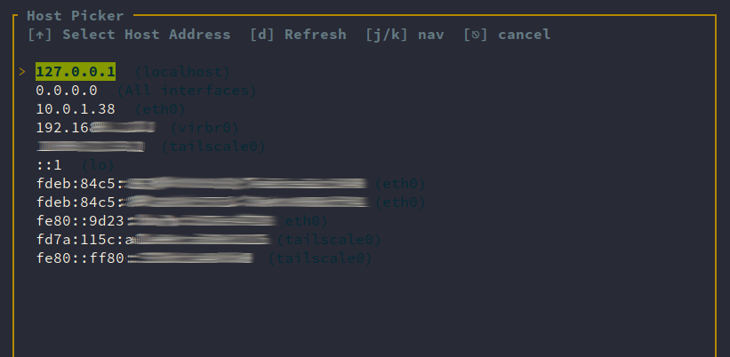
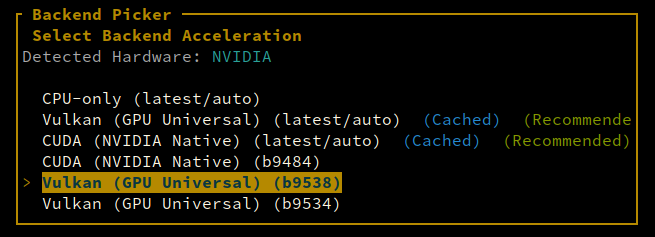
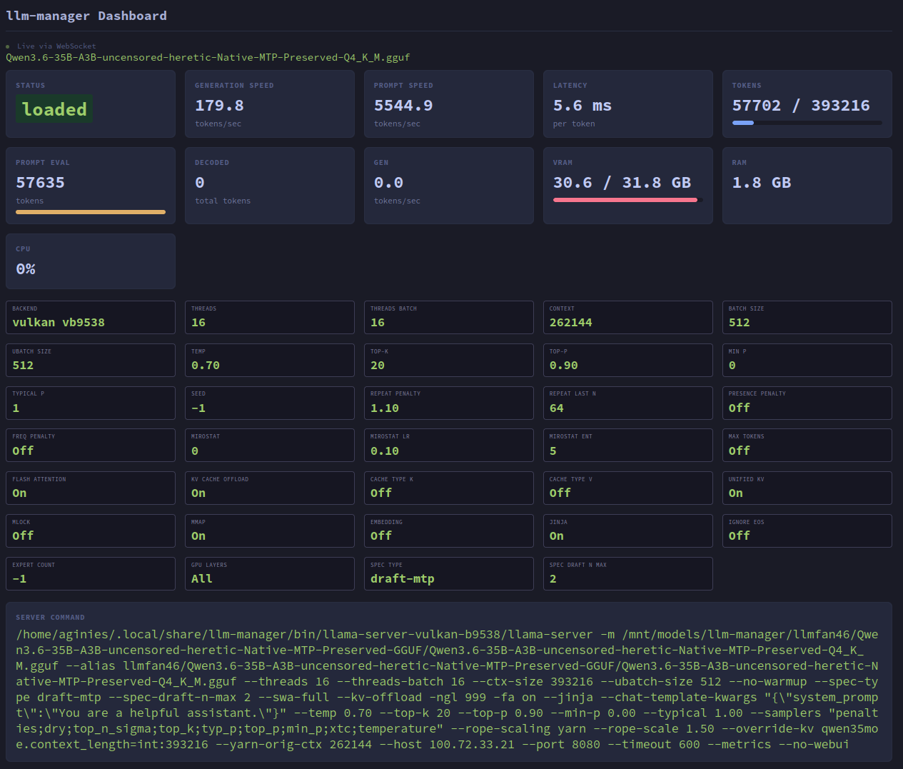
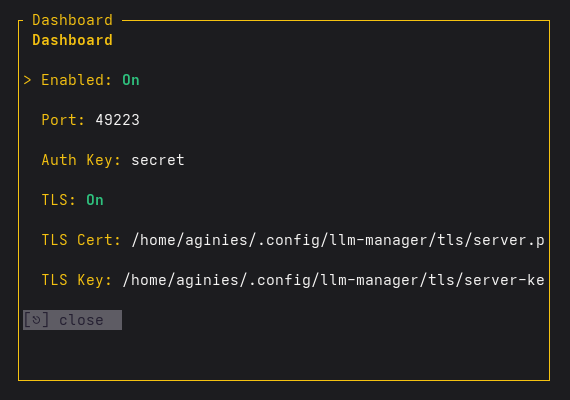

# Server Settings

Server Settings cover the infrastructure and networking configuration of llm-manager.

## Quick Start

The two most important parameters to configure are the Host and Backend selection.

### Host

Bind address for the llama.cpp server. Select from available network interfaces.



### Backend

GPU/CPU backend selection. Choose between CPU, Vulkan, ROCm, CUDA, and platform variants.



---

# API Endpoint

The API Endpoint exposes an OpenAI-compatible API proxy that forwards requests to llama-server.

## Enabling

Enable from the **Server Settings** panel (F2):

1. Navigate to **API Endpoint** and press `Enter`
2. Configure:
    - **Enabled** — toggle on
    - **Port** — default `49222`, configurable via `api_endpoint_port` in config.yaml
    - **API Key** — optional Bearer token for authentication
3. Press `Enter` to save

Or in `~/.config/llm-manager/config.yaml`:

```yaml
default:
  api_endpoint_enabled: true
  api_endpoint_port: 49222
  api_endpoint_key: your-secret-key
```

## Serve Mode

Start with the API proxy from the command line:

```bash
./build.sh serve --model model.gguf --api-port 49222
```

With authentication:

```bash
./build.sh serve --model model.gguf --api-port 49222 --api-key secret
```

In serve mode, `--api-key` sets the key for **both** the API proxy and the WebSocket dashboard (if enabled).

## API Endpoints

The proxy handles these endpoints explicitly:

| Endpoint | Method | Description |
|----------|--------|-------------|
| `/health` | GET | Health check |
| `/metrics` | GET | Prometheus metrics |
| `/v1/chat/completions` | POST | Chat completions (OpenAI) |
| `/v1/completions` | POST | Completions (OpenAI) |
| `/v1/embeddings` | POST | Embeddings |
| `/v1/models` | GET | List models |
| `/api/status` | GET | Server status |

All other paths are proxied to llama-server (chat completions, embeddings, reranking, tokenization, etc.).

## Authentication

When `api_endpoint_key` is configured, clients must include:

```
Authorization: Bearer <key>
```

## TLS / HTTPS

The API proxy shares TLS configuration with the WebSocket dashboard. Enable in config.yaml:

```yaml
default:
  server_tls_enabled: true
  server_tls_cert: /path/to/cert.pem  # optional, auto-generated if omitted
  server_tls_key: /path/to/key.pem     # optional, auto-generated if omitted
```

When TLS is enabled, use `https://localhost:49222` instead of `http://`.

### Auto-generated Certificates

When TLS is enabled without specifying cert/key paths, llm-manager auto-generates a self-signed certificate and CA. Certificates are stored in `~/.config/llm-manager/tls/`:

```
~/.config/llm-manager/tls/
├── ca.pem              # CA certificate
├── ca-key.pem          # CA private key
├── server.pem          # Server certificate
└── server-key.pem      # Server private key
```

To trust the auto-generated CA:

```bash
# Linux (system-wide)
sudo cp ~/.config/llm-manager/tls/ca.pem /usr/local/share/ca-certificates/ && sudo update-ca-certificates

# macOS
sudo security add-trusted-cert -d -r trustRoot -k /Library/Keychains/System.keychain ~/.config/llm-manager/tls/ca.pem
```

## CORS

CORS is enabled for all origins with GET/POST/PUT/DELETE/OPTIONS methods.

## SSE Streaming

The API proxy supports **SSE (Server-Sent Events) streaming** for chat completions and other streaming endpoints. Set `stream: true` in the request body.

---

# WebSocket Dashboard

The WebSocket Dashboard provides a real-time visualization of model metrics and settings via a web browser.

## Accessing the Dashboard

The dashboard runs as a built-in HTTP server on port **49223** by default. Open it in your browser:

```
http://localhost:49223
```

## Enabling in Serve Mode

The dashboard can be enabled in serve mode using the `--ws-enable` flag:

```bash
./build.sh serve --model model.gguf --api-port 49222 --ws-enable
```

Customize the dashboard port:

```bash
./build.sh serve --model model.gguf --api-port 49222 --ws-enable --ws-port 8081
```

> **Note:** In serve mode, `--api-key` sets the key for **both** the API proxy and the WebSocket dashboard (if enabled).

Customize the host and use a specific backend binary:

```bash
./build.sh serve --model model.gguf --api-port 49222 --ws-enable --host 0.0.0.0 --backend-binary /opt/rocm/bin/llama-server
```

The `--host` option controls the bind address for **both** the API proxy server and the WebSocket dashboard server, ensuring they use the same network interface. The default is `127.0.0.1` (from config).

## Enabling in TUI Mode

The dashboard can also be enabled from the TUI:

1. Open the **Server Settings** panel (F2)
2. Navigate to **Dashboard** and press `Enter`
3. Configure:
    - **Enabled** — toggle on/off
    - **Port** — server port (default: 49223)
    - **Auth Key** — optional authentication (see below)
4. Press `Enter` to save, `Esc` to close

## Dashboard Overview

The dashboard displays real-time metrics in a card-based layout:



### Metrics Cards

| Metric | Description |
|--------|-------------|
| **Status** | Current model state (loaded / unloaded / loading) |
| **Generation Speed** | Tokens per second (TPS) for text generation |
| **Prompt Speed** | Tokens per second for prompt processing |
| **Latency** | Milliseconds per token |
| **Tokens** | Tokens generated with progress bar (decoded_tokens / max_tokens, or '∞' if not configured) |
| **VRAM** | GPU memory used/total with color-coded progress bar (green <50%, yellow 50-80%, red >80%) |
| **RAM** | System memory usage |
| **CPU** | CPU usage percentage |

### Settings Panel

Below the metrics, the dashboard shows a grid of current inference settings:

| Setting | Description |
|---------|-------------|
| Backend & Version | llama.cpp backend and version |
| Threads / Threads Batch | CPU thread configuration |
| Context / Batch Size / Ubatch Size | Model execution parameters |
| Temperature / Top-k / Top-p / Min P / Typical P | Sampling parameters |
| Seed | Random seed for reproducibility |
| Repeat Penalty / Repeat Last N | Repetition control |
| Presence Penalty / Frequency Penalty | Advanced repetition control |
| Flash Attention / KV Cache Offload | Performance optimizations |
| Cache Type K / Cache Type V | KV cache quantization |
| Unified KV / Mlock / Mmap | Memory management |
| Expert Count / GPU Layers | Model-specific settings |
| Spec Type / Draft Tokens | Speculative decoding configuration |
| Yarn RoPE / Yarn Params | Context extension parameters |
| Tags | Per-model tags |

### Server Command

The full llama-server command line is displayed at the bottom of the dashboard, showing the exact invocation with all parameters. This is useful for debugging and inspecting the exact configuration being used.

## Configuration

To enable and configure the dashboard:

1. Open the **Server Settings** panel (F2)
2. Navigate to **Dashboard** and press `Enter`
3. Configure:
    - **Enabled** -- toggle on/off
    - **Port** -- server port (default: 49223)
    - **Auth Key** -- optional authentication (see below)
4. Press `Enter` to save, `Esc` to close



## Authentication

When an auth key is configured, clients must include it as a query parameter:

```
http://localhost:49223?auth=mysecretkey
```

## TLS / HTTPS

The WebSocket Dashboard supports TLS (HTTPS) for encrypted connections.

### In TUI Mode

Enable TLS from the **Server Settings** panel (F2 → Dashboard):

1. **Enabled** — toggle on/off (default: off)
2. **TLS** — toggle on/off (default: on)
3. **TLS Cert** — path to a PEM certificate file (optional; leave blank for auto-generated self-signed certificate)
4. **TLS Key** — path to a PEM private key file (optional; leave blank for auto-generated certificate)

When TLS is enabled without specifying cert/key paths, the application auto-generates a self-signed certificate and CA. The certificates are stored in `~/.config/llm-manager/tls/`:

```
~/.config/llm-manager/tls/
├── ca.pem              # CA certificate
├── ca-key.pem          # CA private key
├── server.pem          # Server certificate
└── server-key.pem      # Server private key
```

To trust the auto-generated CA:

```bash
# Linux (system-wide)
sudo cp ~/.config/llm-manager/tls/ca.pem /usr/local/share/ca-certificates/ && sudo update-ca-certificates

# macOS
sudo security add-trusted-cert -d -r trustRoot -k /Library/Keychains/System.keychain ~/.config/llm-manager/tls/ca.pem
```

The dashboard URL changes to `https://` when TLS is enabled:

```
https://localhost:49223
```

### In Serve Mode

Enable TLS from the command line:

```bash
./build.sh serve --model model.gguf --api-port 49222 --ws-enable --tls-enable

# With custom certificate and key
./build.sh serve --model model.gguf --api-port 49222 --ws-enable --tls-enable --tls-cert /path/to/cert.pem --tls-key /path/to/key.pem
```

When `--tls-enable` is set without `--tls-cert`/`--tls-key`, self-signed certificates are auto-generated.

> **Note:** The TLS certificate is also applied to the API proxy server, so both the dashboard and API endpoints use HTTPS.

## Connection Status

The dashboard shows a connection indicator at the top of the page:

- **Green pulsing dot** — Connected via WebSocket
- **Red dot** — Disconnected (auto-reconnects every 2 seconds)

## Architecture

The dashboard server is built with `axum` and `tokio`. It:

1. Creates a `broadcast::channel(64)` for metrics distribution
2. Spawns the server on the configured port
3. Each metrics update is sent to the broadcast channel
4. WebSocket clients subscribe and receive real-time updates
5. The HTML dashboard (embedded in the binary) connects via WebSocket and renders the metrics

The server is started/stopped automatically when you toggle the Dashboard setting in Server Settings.

---

# Web Search

llm-manager can automatically search the web when your chat messages contain research-oriented keywords. Results are fetched via [SearXNG](https://github.com/searxng/searxng) and injected into the prompt before your message, allowing the LLM to cite sources and provide up-to-date information.

## Server-Side Flow

Web search runs **entirely on the llm-manager server**. External clients (chat frontends, curl, etc.) connect to llm-manager's API proxy (default port `49222`) just like any other chat request — no special headers or endpoints needed. The server intercepts chat completions requests, checks for search keywords, performs the SearXNG search, injects the results into the prompt, and forwards the enriched request to llama-server.

```
┌──────────┐     /v1/chat/completions      ┌──────────────────┐
│  Client  │ ──────────────────────────────►│ llm-manager API  │
│ (curl,   │ ◄──────────────────────────────│ proxy (port 49222)│
│  UI, etc)│     SSE streaming response     └────────┬─────────┘
└──────────┘                                        │
                                                    │ triggers SearXNG
                                                    ▼
                                           ┌──────────────────┐
                                           │   SearXNG        │
                                           │   instance       │
                                           └──────────────────┘
```

The `web_search_engine_url` config points to the **SearXNG instance**, not the client. Clients never need direct access to SearXNG — they only talk to llm-manager's API proxy.

## Trigger

Web search triggers when your message contains `$web`:

```
$web best model for coding 2026
$web compare qwen 3 and llama 4
$web recommend vision model
```

## Configuration

### Via Server Settings Panel

1. Open the **Server Settings** panel (press `F2` or `l` when focused)
2. Navigate to the **Web Search** field using arrow keys
3. Press `↵` (Enter) to open the Web Search Picker dialog

The dialog (65 columns wide, 15 rows tall) shows:

| Field | Type | Description |
|-------|------|-------------|
| **Enabled** | Toggle | Shows "On" (green) or "Off" (gray) — press `↵` to toggle |
| **Engine** | Dropdown | Search engine: `searxng` |
| **Engine URL** | Text input | URL of your SearXNG instance (e.g., `https://search.example.com`) |
| **API Key** | Text input | Bearer token for authentication (optional, masked as `****` when set) |

Navigation: `↑`/`↓` (or `j`/`k`) to move between fields, `↵` to toggle/edit, `⎋` (Esc) to close.

### Via config.yaml

Add these fields to your `~/.config/llm-manager/config.yaml`:

```yaml
default:
  web_search_enabled: true
  web_search_engine: searxng
  web_search_engine_url: "https://search.example.com"
  web_search_api_key: null  # optional, omit or set to null if not needed
```

### Per-Model Override

Web search settings can also be configured per-model in `~/.config/llm-manager/models/<model_name>.yaml`:

```yaml
web_search_enabled: true
web_search_engine: searxng
web_search_engine_url: "https://search.example.com"
web_search_api_key: null
```

Model-level settings override the global defaults.

## How It Works

When a message matches a trigger keyword:

1. **Query extraction** — the full user message is used as the search query
2. **SearXNG search** — HTTP GET request to `{engine_url}/search?q={query}&format=json`
3. **Result parsing** — expects JSON with a `results` array; each result needs `title`, `url`, and `content`/`snippet` fields
4. **Page fetching** — Wikipedia results and up to 5 other URLs have their page content fetched in parallel
5. **Context injection** — results are prepended to the message as a `[WEB CONTEXT]...[END WEB CONTEXT]` block

### Request Details

- **Endpoint:** `{engine_url}/search?q={url_encoded_query}&format=json`
- **User-Agent:** `Mozilla/5.0 (X11; Linux x86_64) AppleWebKit/537.36 (KHTML, like Gecko) Chrome/120.0.0.0 Safari/537.36`
- **Authentication:** `Authorization: Bearer {api_key}` header (only if `api_key` is configured)
- **Timeout:** 15 seconds
- **Max results:** 10

### Injected Prompt Format

The web context is prepended to the user message like this:

```
[WEB CONTEXT]
INSTRUCTION: Cite sources using inline markdown links in your answer.

## Search Results
1. **Title** - URL
   snippet text

## Web Context
## [Title](URL)
...fetched page content...

[END WEB CONTEXT]

[Original user message]
```

## Engine Support

| Engine | Status | Notes |
|--------|--------|-------|
| **SearXNG** | ✅ Fully functional | Requires a configured `engine_url` pointing to a SearXNG instance |

## SearXNG Setup

SearXNG must be self-hosted. Official installation guides:

- [SearXNG Docker](https://docs.searxng.org/admin/installation/docker-compose.html)
- [SearXNG Alpine Linux](https://docs.searxng.org/admin/installation/alpine.html)

### Minimal `settings.yaml`

SearXNG requires a `settings.yaml` configuration file. Create one before deploying:

```yaml
use_default_settings: true
search:
  default_lang: en
  # Enable JSON format for API access (required for llm-manager web search)
  formats:
    - json
server:
  secret_key: "change-this-to-a-random-secret"  # generate with: python3 -c "import secrets; print(secrets.token_hex(32))"
  port: 8081
  bind_address: "0.0.0.0"
  # Base URL — required to avoid 303 redirects
  # Set to the public URL where SearXNG is accessible
  # base_url: "http://localhost:8081"  # or "https://search.example.com"
```

### Podman (standalone)

Run SearXNG as a standalone Podman container:

```bash
# Create config directory and settings file
mkdir -p ~/.searxng
cat > ~/.searxng/settings.yaml << 'EOF'
use_default_settings: true
search:
  default_lang: en
  # Enable JSON format for API access (required for llm-manager web search)
  formats:
    - json
server:
  secret_key: "change-this-to-a-random-secret"
  port: 8081
  bind_address: "0.0.0.0"
  # base_url: "http://localhost:8081"  # uncomment if behind reverse proxy
EOF

# Run the container
podman run -d \
  --name searxng \
  -p 8081:8081 \
  -v ~/.searxng/settings.yaml:/etc/searxng/settings.yaml:Z \
  -v ~/.searxng:/etc/searxng/lib/searx:Z \
  --restart unless-stopped \
  searxng/searxng:latest
```

After deployment, use `http://localhost:8081` (or your public URL) as the Engine URL in llm-manager.

### Docker Compose

For Docker Compose users, create `docker-compose.yml`:

```yaml
services:
  searxng:
    image: searxng/searxng:latest
    ports:
      - "8081:8081"
    volumes:
      - ~/.searxng/settings.yaml:/etc/searxng/settings.yaml:Z
    restart: unless-stopped
```

Run with:

```bash
docker compose up -d
```

### podman-compose

For `podman-compose` users:

```yaml
services:
  searxng:
    image: searxng/searxng:latest
    ports:
      - "8081:8081"
    volumes:
      - ~/.searxng/settings.yaml:/etc/searxng/settings.yaml:Z
    restart: unless-stopped
```

Run with:

```bash
podman-compose up -d
```

## Settings Panel Display

The LLM Settings panel shows the current web search status:

```
Web Search (Enabled: searxng)
```
or
```
Web Search (Disabled: searxng)
```

## Troubleshooting

- **303 redirect** — set `server.base_url` in `settings.yaml` to the public URL (e.g., `http://localhost:8081` or `https://search.example.com`)
- **Search returns no results** — verify the Engine URL is accessible and points to a running SearXNG instance
- **Timeout errors** — web search has a 15-second timeout; slow SearXNG instances may need tuning
- **Authentication failures** — if `web_search_api_key` is set, ensure the SearXNG instance accepts the Bearer token
- **Results not appearing in chat** — check that trigger keywords are present in the message
- **HTTPS certificate errors** — ensure the SearXNG instance has valid TLS certificates if using `https://`

---

# Router Mode & Multi-Model Inference

Router Mode enables loading and managing multiple models simultaneously through a single llama-server instance. This is useful for A/B testing models, building model routing systems, or comparing different models in a shared environment.

## What is Router Mode?

Router Mode uses llama.cpp's router API to load multiple models into a single server process. Each model is addressed by its unique identifier, allowing clients to route requests to specific models.

## Enabling Router Mode

1. Open Server Settings (`F2` or navigate to Server Settings panel)
2. Set **Mode** to `Router`
3. Set **Router Max Models** to your desired limit (default: 4)
4. Load your first model normally

## Loading Models

In Router Mode, models are loaded via the API endpoint `/models/load`:

```bash
curl -X POST http://localhost:8080/models/load \
  -H "Content-Type: application/json" \
  -d '{"model": "model_name"}'
```

Or through the TUI:
1. Select a model in the Models panel
2. Press `l` or `Enter` to load it

Each loaded model shows its status in the Models panel with the port and PID.

## Managing Models

### Listing Loaded Models

Get all loaded models and their status:

```bash
curl http://localhost:8080/models
```

Response format:
```json
[
  {
    "id": "model_name",
    "object": "model",
    "owned_by": "user",
    "path": "/path/to/model.gguf"
  }
]
```

### Unloading Models

Unload a specific model:

```bash
curl -X POST http://localhost:8080/models/unload \
  -H "Content-Type: application/json" \
  -d '{"model": "model_name"}'
```

Or in the TUI:
1. Select a loaded model
2. Press `u` to unload it

### Deleting Models

Delete a model (moves to unused directory):
1. Select the model
2. Press `Ctrl+D`
3. Confirm deletion

## VRAM Management

### Understanding VRAM Usage

Each loaded model consumes VRAM proportional to:
- Model size (quantization level)
- GPU layers offloaded
- Context length
- Batch size

### Monitoring VRAM

The Active Model panel shows:
- **VRAM:** GPU memory used/total per model
- **Total VRAM:** Sum of all model VRAM usage
- **Context usage:** Progress bar showing ctx_used/ctx_max

### VRAM Estimation

The app computes VRAM estimates based on:
- Model file size (with MoE expert ratio applied to FFN portion for mixture-of-experts models)
- GPU layers mode (Auto/Specific/All)
- KV cache settings (Flash Attention, quantization, YaRN RoPE scale)
- Activation overhead (8× multiplier)
- Fixed overhead (3.8% of max VRAM)

The estimate is shown in the LLM Settings title (e.g., "VRAM ~= 8.2 GB").

### Best Practices

- **Leave headroom:** Keep 10-20% VRAM free for KV cache and activations
- **Use lower quantization:** Q4_K_M or Q5_K_M for better multi-model support
- **Reduce context length:** Shorter contexts use less VRAM
- **Monitor Total VRAM:** The Active Model panel shows combined usage

## Configuration

### Router Max Models

Set the maximum number of models that can be loaded simultaneously.

In config.yaml:
```yaml
default:
  router_max_models: 4
```

In the TUI:
1. Open Server Settings
2. Navigate to Router Max Models
3. Adjust value (1-10)

### Per-Model Settings

Each model can have its own settings:
- Context length
- GPU layers
- Temperature
- Sampling parameters

Settings are stored in `~/.config/llm-manager/models/<name>.yaml`.

## API Usage

### Chat Completions

Route to a specific model:

```bash
curl http://localhost:8080/v1/chat/completions \
  -H "Content-Type: application/json" \
  -d '{
    "model": "model_name",
    "messages": [{"role": "user", "content": "Hello"}]
  }'
```

### Streaming

Enable SSE streaming:

```bash
curl http://localhost:8080/v1/chat/completions \
  -H "Content-Type: application/json" \
  -d '{
    "model": "model_name",
    "messages": [{"role": "user", "content": "Hello"}],
    "stream": true
  }'
```

## Use Cases

### Model Comparison

Load multiple models to compare outputs:

1. Load Model A and Model B
2. Send the same prompt to both
3. Compare generation quality and speed

### Specialized Models

Run different models for different tasks:

- **Coder model:** Optimized for code generation
- **Math model:** Optimized for mathematical reasoning
- **General model:** For everyday conversations

Route requests based on the task type.

### A/B Testing

Test model updates without downtime:

1. Load the old model
2. Load the new model
3. Route some traffic to each
4. Compare metrics

## Limitations

### VRAM Constraints

- Each model consumes VRAM independently
- Total VRAM cannot exceed GPU capacity
- KV cache for each model is allocated separately

### Model Conflicts

- Models with different architectures may have compatibility issues
- Some parameters (like context length) are model-specific
- Loading/unloading affects all models in the server

### Performance

- Shared server means shared CPU/GPU resources
- Heavy models may impact lighter model performance
- Monitor system resources during multi-model operation

## Troubleshooting

### "VRAM exceeded" error

- Reduce GPU layers for loaded models
- Use lower quantization models
- Unload unused models
- Reduce context length

### Model fails to load

- Check model path is correct
- Verify model file exists and is readable
- Check available VRAM
- Review server logs for specific errors

### Slow performance

- Reduce number of loaded models
- Check for resource contention
- Verify GPU is being used (not CPU fallback)
- Monitor system resources

### Router API not responding

- Verify server is running on the expected port
- Check network connectivity
- Ensure router mode is enabled
- Review server logs for errors

---

# Benchmark Tuning

Benchmark Tuning finds the optimal settings for your model and hardware by automatically testing multiple parameter combinations and measuring performance.

## When to Benchmark

Benchmark before deploying a model in production to:
- Find the fastest settings for your specific GPU/CPU
- Compare tradeoffs between throughput (TPS) and latency
- Determine the best context length for your use case
- Validate speculative decoding improvements
- Compare different backends (CPU vs Vulkan vs ROCm vs CUDA)

## Accessing Benchmark Mode

Set the server **Mode** to `BenchTune` in Server Settings, then press `Enter` to open the BenchTune Setup modal.

## Benchmark Modes

Two modes are available, each with different tradeoffs:

### RuntimeOnly (Recommended)

Single server, all parameters sent in the request body. No server restarts between tests.

- **Pros:** Fast (seconds per test), low overhead, preserves server state
- **Cons:** Some parameters may not be reconfigurable at runtime
- **Best for:** Sampling parameters (temperature, top-k, top-p), repetition control, DRY settings

### Full

Spawns a new server for each parameter combination.

- **Pros:** Tests all parameters including server-level settings (threads, context, GPU layers)
- **Cons:** Slow (minutes per test due to server startup), higher resource usage
- **Best for:** Hardware-level parameters, backend selection, architecture tuning

## Tunable Parameters

The following parameters can be tuned. Enable/disable each with `Space`:

| Parameter | Range | Description | Server/Client |
|-----------|-------|-------------|---------------|
| **Temperature** | 0.4–1.0 | Sampling randomness | Both |
| **Top-p** | 0.8–1.0 | Nucleus sampling threshold | Both |
| **Top-k** | 10–40 | Token sampling window | Both |
| **Repeat Penalty** | 1.0–1.5 | Repetition suppression | Both |
| **Flash Attention** | 0/1 | Enable/disable Flash Attention 2 | Server |
| **Threads** | 4–16 | CPU threads for generation | Server |
| **Batch Size** | 512–2048 | Logical maximum batch size | Server |
| **Expert Count** | -1–4 | MoE experts per token (MoE models) | Server |
| **Context Length** | Model default–max | Context window size | Server |
| **Spec Type** | draft-mtp, ngram-simple, etc. | Speculative decoding method | Server |
| **Draft Tokens** | 0–8 | Draft tokens per step (speculative) | Server |

### Server vs Client Parameters

- **Server parameters** require a full server restart to change (threads, context, flash attention). Use `Full` mode.
- **Client parameters** can be changed per-request (temperature, top-p, top-k). Use `RuntimeOnly` mode.

## Benchmark Configuration

### Prompt

The prompt used for each test iteration. Default:

```
Create Mona Lisa image in ascii art using text, number, symbol, everything possible. this should be the perfect painting.
```

Edit with `Alt+P`. Use a prompt representative of your actual workload for meaningful results.

### n-predict (Max Tokens)

Number of tokens to generate per test. Default: 512.

Edit with `Alt+N`. Higher values give more stable TPS measurements but take longer.

### Iterations

Number of test iterations per parameter combination. Default: 3.

Edit with `Alt+I`. More iterations reduce variance but increase total benchmark time.

### Test Duration

Maximum time per test iteration. Default: 30 seconds.

### Test Timeout

Maximum time for the entire benchmark run. Default: 60 seconds.

## Running a Benchmark

1. Set Mode to `BenchTune` in Server Settings
2. Press `Enter` to open BenchTune Setup
3. Select parameters to test with `Space`
4. Adjust parameter ranges (min/max/step)
5. Choose mode: `RuntimeOnly` or `Full` (toggle with `Alt+M`)
6. Edit prompt (`Alt+P`), n-predict (`Alt+N`), iterations (`Alt+I`)
7. Press `Enter` to start

The benchmark runs automatically. Progress is shown in the Active Model panel with a progress bar and current parameter display.

## Interpreting Results

Results include these metrics per test:

| Metric | Description | What it means |
|--------|-------------|---------------|
| **Prompt TPS** | Tokens processed per second during prompt evaluation | How fast the model reads your input |
| **Generation TPS** | Tokens generated per second | How fast the model produces output |
| **Combined TPS** | Total tokens (prompt + generation) per total time | Overall throughput |
| **Latency/Token** | Milliseconds per generated token | User-perceived responsiveness |
| **First Token Time** | Milliseconds until first token appears | Time to first response |

### Reading the Results Table

Results are displayed in a table sorted by combined TPS (descending). Use `n` (next) and `p` (previous) to navigate between results.

The **winner** section highlights the best configuration. Look for:
- Highest generation TPS for chat applications
- Lowest latency/token for interactive use
- Lowest first-token-time for responsive UX

### Impact Analysis

Each result includes an impact analysis showing how each parameter change affected performance:
- **Positive impact:** Parameter increased throughput
- **Negative impact:** Parameter decreased throughput
- **Neutral:** No significant change

## Exporting Results

Results can be exported in multiple formats. Press `e` in the results view to export:

| Format | Use Case |
|--------|----------|
| **Markdown table** | Documentation, sharing via chat/email |
| **JSON** | Programmatic analysis, CI/CD pipelines |
| **YAML** | Configuration files, version control |
| **HTML report** | Visual analysis with Chart.js charts |

The HTML report includes:
- Summary cards with key metrics
- Winner section with recommended configuration
- Impact analysis charts
- Per-parameter performance breakdowns
- Chart.js interactive charts for visual comparison

## Example Workflows

### Quick Chat Optimization

Goal: Find best settings for a chat application.

1. Set Mode to `BenchTune`
2. Enable: Temperature, Top-p, Top-k, Repeat Penalty
3. Select `RuntimeOnly` mode
4. Set iterations to 5 for stable results
5. Run benchmark
6. Export as Markdown for documentation

### Hardware Stress Test

Goal: Find maximum throughput on your hardware.

1. Set Mode to `BenchTune`
2. Enable: Threads, Batch Size, Context Length, Flash Attention
3. Select `Full` mode (tests server-level params)
4. Set iterations to 3
5. Run benchmark (may take 20-30 minutes)
6. Export as HTML for visual analysis

### Speculative Decoding Comparison

Goal: Compare speculative decoding methods.

1. Set Mode to `BenchTune`
2. Enable: Spec Type, Draft Tokens
3. Select `Full` mode
4. Set n-predict to 256 for meaningful speculative gains
5. Run benchmark
6. Compare first-token-time across spec types

## Tips and Best Practices

- **Use representative prompts:** Benchmark with prompts similar to your actual workload
- **Control variables:** Change one parameter at a time for clear attribution
- **Run multiple iterations:** Use at least 3 iterations to reduce variance
- **Warm up:** Let the model run for a few tokens before measuring (handled automatically)
- **Monitor system resources:** Watch for CPU/GPU saturation during benchmarks
- **Compare baselines:** Always benchmark against your current settings
- **Document results:** Export results to track improvements over time

## Troubleshooting

### Benchmark hangs or times out

- Increase `Test Timeout` in BenchTune Setup
- Reduce `n-predict` to shorter generation tasks
- Check server logs for errors

### Inconsistent results

- Increase `Iterations` for more stable averages
- Ensure no other processes are competing for GPU/CPU
- Close other applications using the GPU

### Low TPS values

- Verify GPU is being used (check VRAM usage)
- Try enabling Flash Attention if supported
- Increase batch size if VRAM allows
- Check that threads match your physical core count

### Benchmark fails on certain parameters

- Some parameters cannot be changed at runtime (use `Full` mode)
- Context length changes require server restart
- Backend-specific parameters may not be tunable

---

# Distributed Inference (RPC Workers)

RPC Workers enable distributed inference across multiple machines. Each worker runs a `llama-rpc-server` that exposes part of a model or a complete model for remote inference.

## What is Distributed Inference?

Distributed inference splits model computation across multiple machines, allowing you to:
- Combine GPU resources from multiple machines
- Run models larger than a single GPU's VRAM
- Reduce latency by placing workers closer to clients
- Scale inference horizontally

## Architecture

```
                    ┌─────────────────┐
                    │   llm-manager   │
                    │   (TUI Client)  │
                    └────────┬────────┘
                             │ RPC
               ┌──────────────┼──────────────┐
               │              │              │
        ┌───────▼──────┐ ┌────▼─────┐ ┌──────▼──────┐
        │  Worker 1    │ │ Worker 2 │ │  Worker 3   │
        │  (GPU: A100) │ │(GPU: 4090)│ │ (GPU: A6000)│
        └──────────────┘ └──────────┘ └─────────────┘
```

## Setting Up Workers

### Prerequisites

- `llama-rpc-server` binary on each worker machine
- Network connectivity between client and workers
- Consistent llama.cpp versions across all machines

### Installing llama-rpc-server

Each worker machine needs the RPC server binary:

```bash
# Download from llama.cpp releases
wget https://github.com/ggml-org/llama.cpp/releases/download/b4100/llama-rpc-server-ubuntu-x64.tar.gz
tar -xzf llama-rpc-server-ubuntu-x64.tar.gz
```

### Starting a Worker

Start the RPC server on each worker machine:

```bash
./llama-rpc-server \
  --model /path/to/model.gguf \
  --host 0.0.0.0 \
  --port 50052
```

Parameters:
- `--model`: Path to the GGUF model file
- `--host`: Bind address (use `0.0.0.0` for network access)
- `--port`: RPC port (default: 50052)

## Managing Workers in TUI

### Opening the RPC Manager

1. Open Server Settings (`F2`)
2. Navigate to **RPC Workers**
3. Press `Enter` to open the RPC Workers manager

### Adding a Worker

1. In the RPC Workers manager, press `n` to add a new worker
2. Enter worker details: `[Name], [IP], [Port]`
    - Example: `GPU-A100, 192.168.1.10, 50052`
    - Or: `192.168.1.10, 50052` (name auto-generated)
    - Or: `192.168.1.10` (name and port use defaults)
3. Press `Enter` to save

### Editing a Worker

1. Select the worker in the list
2. Press `e` to edit
3. Modify the details
4. Press `Enter` to save

### Deleting a Worker

1. Select the worker
2. Press `d` to delete
3. Confirm deletion

### Selecting Workers

1. Use `Space` to toggle worker selection
2. Selected workers are combined into the `--rpc` flag when starting the server
3. Only selected workers are used for inference

## Worker Configuration

### Worker Properties

Each worker has these properties:

| Property | Description | Example |
|----------|-------------|---------|
| **Name** | Human-readable identifier | `GPU-A100-Rack1` |
| **IP** | Network address of the worker | `192.168.1.10` |
| **Port** | RPC server port (default: 50052) | `50052` |
| **Selected** | Whether to use this worker | `true`/`false` |

### Network Configuration

#### Firewall Rules

Ensure port 50052 (or your chosen port) is open:

```bash
# Ubuntu/Debian
sudo ufw allow 50052/tcp

# CentOS/RHEL
sudo firewall-cmd --add-port=50052/tcp --permanent
sudo firewall-cmd --reload
```

#### SSH Tunneling

For secure connections without opening ports:

```bash
ssh -L 50052:localhost:50052 user@remote-worker
```

Then use `localhost:50052` as the worker address in llm-manager.

## Using Distributed Inference

### Loading a Model Across Workers

1. Configure and select your workers
2. Set Mode to `Router` (Work In Progress — not yet selectable in TUI) or `Normal`
3. Load your model
4. The model is distributed across selected workers

### Monitoring Workers

The Active Model panel shows total VRAM usage across all workers. Per-worker metrics are not yet displayed in the TUI.

### RPC Settings

Configure RPC behavior in LLM Settings:

| Setting | Description |
|---------|-------------|
| **RPC** | Comma-separated list of worker endpoints |
| **Tensor Split** | Fraction of model per GPU (for multi-GPU workers) |

Example RPC string: `localhost:50052,192.168.1.10:50052`

## Use Cases

### Multi-GPU Workstation

Combine multiple GPUs in a single workstation:

```
Worker 1: localhost:50052 (GPU 0 - RTX 4090)
Worker 2: localhost:50053 (GPU 1 - RTX 4090)
```

### Distributed Data Center

Spread inference across a data center:

```
Worker 1: 10.0.1.10:50052 (A100 80GB)
Worker 2: 10.0.1.11:50052 (A100 80GB)
Worker 3: 10.0.1.12:50052 (A100 80GB)
```

### Edge Computing

Deploy workers close to end users:

```
Worker 1: us-east.worker.example.com:50052
Worker 2: eu-west.worker.example.com:50052
Worker 3: ap-southeast.worker.example.com:50052
```

## Troubleshooting

### Worker Connection Failed

- Verify worker IP address is correct
- Check firewall rules allow port 50052
- Ensure `llama-rpc-server` is running on the worker
- Test connectivity: `nc -zv <worker-ip> 50052`

### Model Fails to Load

- Verify all workers have sufficient VRAM
- Check network latency between workers (should be <1ms for optimal performance)
- Ensure llama.cpp versions match across all workers
- Review worker logs for errors

### Slow Inference

- Check network bandwidth between client and workers
- Verify workers are not CPU-bound
- Monitor GPU utilization on each worker
- Consider reducing model size or context length

### Worker Disconnected

- Check worker machine is still running
- Verify network connectivity
- Restart `llama-rpc-server` if needed
- Re-select the worker in llm-manager

## Best Practices

### Hardware Selection

- Use GPUs with similar capabilities for balanced performance
- Prefer GPUs with high memory bandwidth (A100, H100, RTX 4090)
- Ensure sufficient VRAM for your model size

### Network Setup

- Use wired connections (Ethernet) for workers
- Minimize network latency between workers (<1ms ideal)
- Use dedicated network interfaces for RPC traffic if possible

### Monitoring

- Monitor VRAM usage on each worker
- Track network latency and throughput
- Set up alerts for worker disconnections
- Log inference metrics for capacity planning

### Security

- Use SSH tunneling for untrusted networks
- Implement firewall rules to restrict access
- Consider TLS for RPC communication (if supported by your llama.cpp version)
- Use strong authentication for remote workers

## Advanced Configuration

### Custom Ports

Each worker can use a different port:

```
Worker 1: 192.168.1.10:50052
Worker 2: 192.168.1.11:50053
Worker 3: 192.168.1.12:50054
```

### Dynamic Worker Management

Workers can be added/removed without restarting the server:

1. Open RPC Workers manager
2. Add new worker
3. Select the worker
4. Reload the model to incorporate the new worker

### Worker Health Checks

The app automatically checks worker health:
- Connection status shown in RPC Workers manager
- Failed workers are marked and excluded from inference
- Reconnection attempts are made automatically
