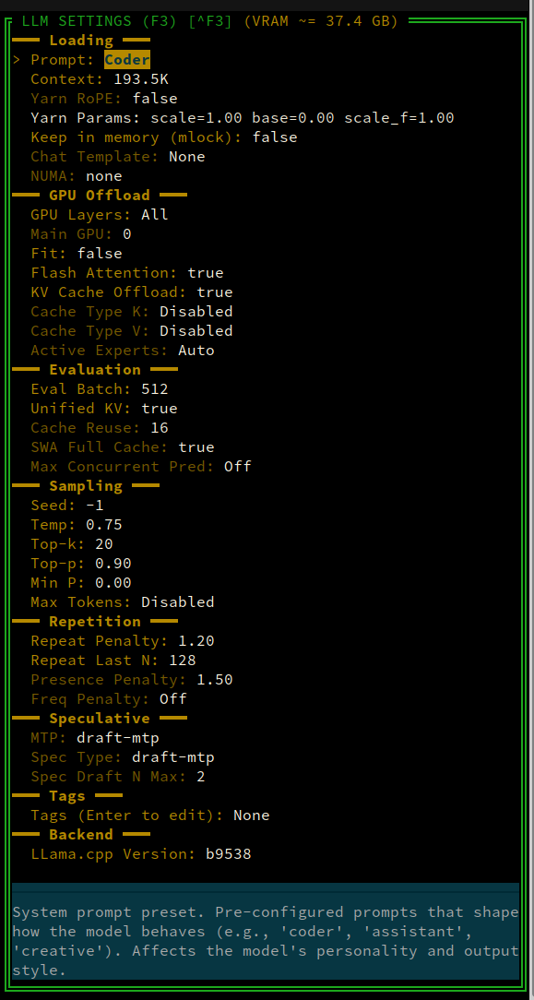
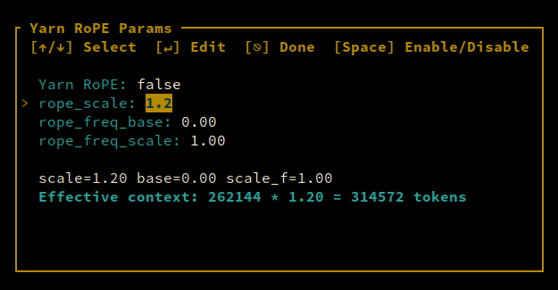
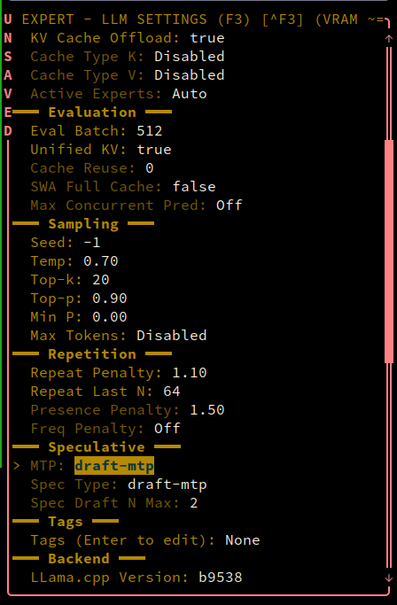
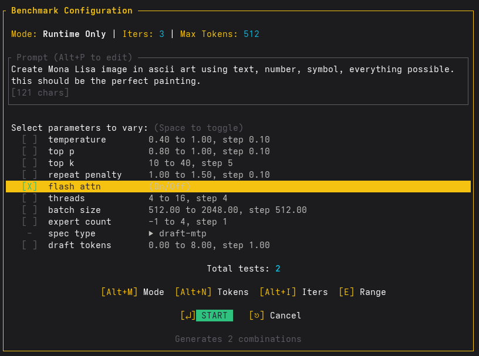
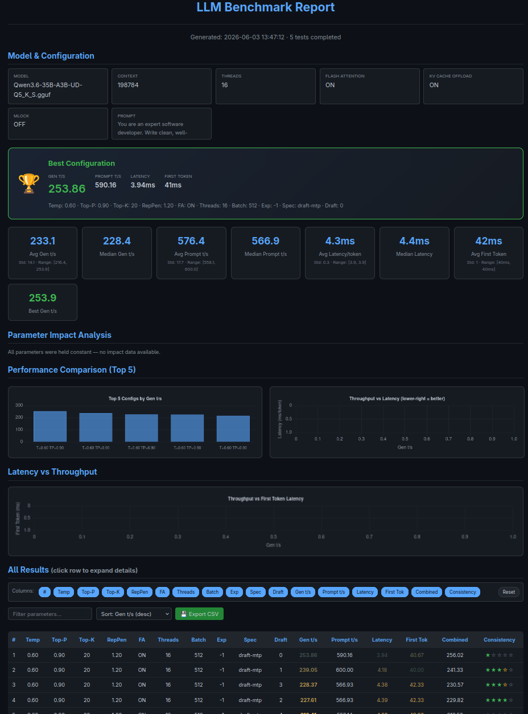
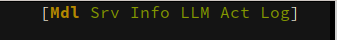
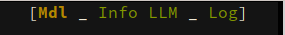
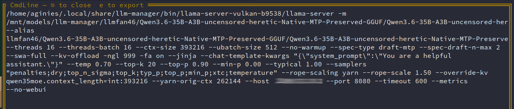
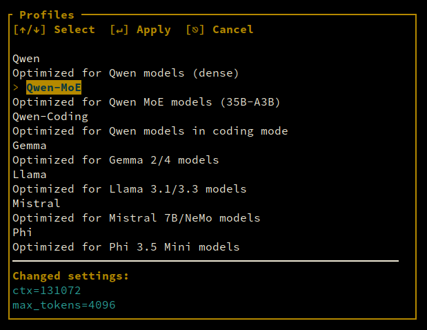

# Usage

## Serve Mode

Run a model directly with llama-server and expose an OpenAI-compatible API:

```bash
# Serve a model with API proxy on port 49222
./build.sh serve --model /path/to/model.gguf --api-port 49222

# Serve with a settings profile
./build.sh serve --model model.gguf --profile qwen

# Serve with API key authentication (same key for API proxy and dashboard)
./build.sh serve --model model.gguf --api-port 49222 --api-key secret --ws-enable

# Serve with API proxy and WebSocket dashboard
./build.sh serve --model model.gguf --api-port 49222 --ws-enable

# Serve with custom dashboard port
./build.sh serve --model model.gguf --api-port 49222 --ws-enable --ws-port 8081

# Serve with a custom backend binary path
./build.sh serve --model model.gguf --backend-binary /path/to/custom/llama-server

# Serve bound to a specific network interface
./build.sh serve --model model.gguf --host 0.0.0.0

# Redirect logs to a file (useful for systemd)
./build.sh serve --model model.gguf --log-file /var/log/llm-manager/model.log

# Combine options
# Serve with API proxy and WebSocket dashboard on a specific host
./build.sh serve --model model.gguf --api-port 49222 --ws-enable --host 192.168.1.100

# Combine all options
./build.sh serve --model model.gguf --api-port 49222 --ws-enable --host 0.0.0.0 --backend-binary /opt/rocm/bin/llama-server --log-file /var/log/llm-manager/model.log
```

The serve command automatically resolves the llama-server binary from the backend-specific directory (`~/.local/share/llm-manager/bin/llama-server-{cpu,vulkan,rocm}-{version}/`) and sets `LD_LIBRARY_PATH` for shared libraries. If the binary is not found, it downloads it from the llama.cpp GitHub releases. Use `--backend-binary` to specify a custom binary path, `--host` to override the network bind address for both the API proxy and WebSocket servers (default is from config), and `--log-file` to redirect logs to a file instead of stdout.

## Model Management

### Listing Models

The Models panel shows all `.gguf` files found in your models directories (recursively). The display name is the relative path from the models directory.

- `f` — Filter local models by name (case-insensitive substring match)
- `Esc` — Clear active filter and return to full list

### Loading and Unloading

- `l` or `Enter` — Load selected model
- `u` — Unload model from server
- `Ctrl+D` — Delete model (with confirmation)

When a model is loaded, it shows **[LOADED: \<name\>]** in green bold. You can load multiple models when using Router mode *(Work In Progress — not yet selectable in TUI, enable via config.yaml)*.

### Deleting Models

Pressing `Ctrl+D` prompts for confirmation before moving the model file and its YAML config to `~/.config/llm-manager/unused/`. Both can be restored later.

## Search

Search mode lets you browse and download GGUF models from HuggingFace:

| Key | Action |
|-----|--------|
| `/` | Open search input modal — type query and press `Enter` to search |
| `Enter` | Select GGUF files for the highlighted model |
| `Esc` | Exit search |
| `Ctrl+S` | Cycle sort order |
| `Ctrl+B` | Go back one page |
| `Down` (at bottom) | Load more results |
| `Ctrl+R` | Fetch and view README for the selected model |

### Multi-word Search

Type space-separated words (e.g. `qwen opus`) to search with AND logic — all words must match the model name. Matching words are highlighted in cyan in the results list.


### GGUF File Browser

When viewing GGUF files for a model:

| Key | Action |
|-----|--------|
| `j` / `k` | Navigate files |
| `Enter` | Download selected file |
| `Esc` | Go back to search results |
| `⌥C` | Cancel download and remove temp file |

### Download Panel

When one or more files are downloading, the Download panel appears at the bottom of the screen, showing progress, speed (MiB/s), ETA, and status for each download. Before downloading, the app checks available disk space and warns if insufficient. Cancelled downloads automatically remove the temporary file.

| Key | Action |
|-----|--------|
| `j` / `k` | Navigate downloads |
| `p` | Pause / Resume selected download |
| `⌥C` | Cancel selected download and remove temp file |

Status indicators: **Downloading** (yellow), **Paused** (white), **Complete** (green), **Cancelled** (red), **Error** (red).

## Loading Models

When you load a model, the application:

1. Resolves the llama-server binary for the selected backend (CPU/Vulkan/ROCm)
2. Spawns the server with the current settings
3. Loads the model via the server's `/models/load` API
4. Polls the server's `/metrics` and `/health` endpoints for status
5. Displays a progress bar showing loading phases

### Loading Phases

The progress bar tracks:

- **Server starting** (8%) — llama.cpp binary is launched
- **Loading model** (7%) — weights file is being read
- **Loading metadata** (7%) — GGUF metadata is parsed
- **Loading tensors** (70%) — tensors are loaded and offloaded to GPU
- **Server listening** (8%) — HTTP server is ready
- **Complete** — model is ready for inference

During tensor loading, the progress bar shows offloaded layers (e.g., `16/32`) parsed from llama.cpp's log output.

## Settings

### Server Settings

| Setting | Default | Description |
|---------|---------|-------------|
| **Host** | 127.0.0.1 | Bind address for the llama.cpp server. Use `0.0.0.0` to accept connections from other machines. |
| **Backend** | auto-detected | Acceleration backend: auto-detected based on GPU (Cuda for NVIDIA, Rocm for AMD, Vulkan for Intel). Options: `cpu` (CPU-only), `vulkan` (NVIDIA/AMD/Intel GPU), `rocm` (AMD GPU), `rocm-lemonade` (AMD optimized), `cuda` (NVIDIA CUDA 12.8). Shows the currently selected version. |
| **Threads** | (physical cores) | CPU threads for generation. Set to your physical core count for best performance. |
| **Threads Batch** | 8 | CPU threads for batch processing (prompt evaluation). |
| **Mode** | Normal | Server mode: `Normal` (single model), `Router` (multiple models), `Bench` (run llama-bench), or `BenchTune` (parameter auto-tuning). |
| **API Endpoint** | false | Enable the API proxy server (see Serve Mode). |
| **Dashboard** | false | WebSocket dashboard server (port 49223). Press `Enter` to configure (enabled, port, auth key, TLS). |
| **RPC Workers** | None | Open a dedicated window to manage distributed inference nodes (IP:Port). |
| **Language** | en | UI language. Press `Enter` to cycle between English, French, and Italian. |

> **Note:** The Server Settings panel is hidden when a server is already running. Press `F2` to toggle Server Settings only when no server is active.

### LLM Settings

The LLM Settings panel has 19 standard fields, 12 expert fields (revealed with `Ctrl+X`), and 15 ultra fields (hidden even in expert mode), for a total of 46 fields. Arrow keys adjust values; `+`/`-` for coarse changes, `Left`/`Right` for fine. Toggle fields respond to `e` or `Ctrl+E`.



#### Loading

| Field | Default | Description |
|-------|---------|-------------|
| **Prompt** | General | System prompt preset that defines the model's initial behavior. Presets include General, Coder, Thinker, Mathematician, and any user-defined prompts. |
| **Context** | 131072 | Context window size in tokens. Larger values consume more VRAM and RAM. Models often have a maximum context length (e.g., 32K, 128K). |
| **Keep in memory** | false | Locks model weights in RAM (`-mlock`) to prevent the OS from swapping them out. Useful when repeatedly loading/unloading models. Increases RAM usage. |

The **Ctx (U)** column in the Models panel shows the user-configured context length from LLM settings (the `(U)` suffix distinguishes it from the model's actual loaded context). This value comes from the Context field above and applies to all loaded models unless overridden per-model.

#### GPU Offload

| Field | Default | Description |
|-------|---------|-------------|
| **GPU Layers** | Auto | Number of model layers offloaded to GPU memory. `Auto` lets llama.cpp decide based on available VRAM. `Specific` sets an exact number. `All` offloads every layer (`-ngl 999`). |
| **Flash Attention** | true | Enables Flash Attention 2 for faster inference with lower memory usage. Requires GPU support. Can improve throughput by 20-40%. |
| **KV Cache Offload** | true | Offloads the KV cache to RAM when GPU memory is full. Trade-off: more VRAM available for model weights at the cost of slower cache access. |
| **Cache Type K** | F16 | Data type for the key cache. Options: F32 (most accurate, most memory), F16 (default), BF16 (better than F16 for some models), Q8_0, Q5_0, Q5_1, Q4_0, Q4_1, Iq4Nl. |
| **Cache Type V** | F16 | Data type for the value cache. Same options as Cache Type K. Using lower precision reduces VRAM but may affect quality. |
| **Active Experts** | 1 | For Mixture-of-Experts (MoE) models, the number of experts activated per token. Higher values improve quality but increase compute. |

#### Evaluation

| Field | Default | Description |
|-------|---------|-------------|
| **Eval Batch** | 512 | Logical maximum batch size for evaluation. Larger batches improve throughput but increase memory usage. Set to the model's native context length for single-sequence inference. |
| **Unified KV** | true | Shares KV cache across sequences, reducing memory usage when running multiple prompts. Can cause cache eviction conflicts. |

#### Sampling

| Field | Default | Description |
|-------|---------|-------------|
| **Seed** | -1 | Random seed for reproducible outputs. `-1` means random each time. Set to a fixed value for debugging or reproducibility. |
| **Temperature** | 0.8 | Controls randomness in sampling. Higher values (1.0-2.0) produce more creative/divergent outputs. Lower values (0.0-0.5) produce more deterministic/crisp outputs. |
| **Top-k** | 40 | Limits sampling to the k most likely next tokens. `0` disables. Smaller values make outputs more focused. Typical: 20-50. |
| **Top-p** | 0.95 | Nucleus sampling: limits to tokens whose cumulative probability reaches p. `1.0` disables. Lower values (0.8-0.95) reduce randomness. |
| **Min P** | 0.0 | Minimum probability threshold for sampling. Tokens with probability below this fraction of the highest-probability token are excluded. Useful for controlling extreme outputs. |
| **Max Tokens** | None (unlimited) | Maximum tokens to generate per response. None means no limit (until EOS token). |

#### Repetition Control

| Field | Default | Description |
|-------|---------|-------------|
| **Repetition Penalty** | 1.1 | Penalizes tokens that have already appeared. Values > 1.0 reduce repetition. Typical: 1.1-1.2. |
| **Rep. Last N** | 64 | Number of recent tokens to consider for repetition penalty. `-1` uses the full context. |

#### Yarn RoPE

| Field | Default | Description |
|-------|---------|-------------|
| **Yarn RoPE** | false | Enables YaRN (Yet another RoPE extensioN) for extending context beyond the model's training length. |
| **Yarn Params** | — | Opens a modal to configure three floating-point values: `rope_scale` (default 1.0, multiplies context), `rope_freq_base` (default 0.0, overrides the model's base frequency), `rope_freq_scale` (default 1.0, scales the frequency). Only digits, `.`, `-`, `e`, and `E` are accepted. |



#### Tags

| Field | Default | Description |
|-------|---------|-------------|
| **Tags** | None | Per-model tags stored in the YAML config. Press `Enter` to open the tag editor modal. Press `t` in the LLM Settings panel to open the tag editor. |

#### Backend

| Field | Default | Description |
|-------|---------|-------------|
| **LLama.cpp Version** | Latest | Shows the currently selected backend version. Press `Enter` to open the backend version picker. |

#### Expert Mode

Press `Ctrl+X` to toggle expert mode, which reveals 17 additional parameters:

**Loading (expert):** NUMA (None/Distribute/Isolate/Numactl)

**GPU (expert):** Cache Type K (toggle), Cache Type V (toggle), Main GPU, Fit, Active Experts (toggle)

**Sampling (expert):** Mirostat (Off/1/2), Mirostat LR, Mirostat Ent, Ignore EOS (toggle)

**Repetition (expert):** Presence Penalty (toggle, -2.0 to 2.0), Frequency Penalty (toggle, -2.0 to 2.0)

**Speculative (expert):** MTP (toggle), Spec Type, Spec Draft N Max

**Evaluation (expert):** SWA Full Cache (toggle), Cache Reuse

These fields follow the same navigation and editing rules as standard fields. Arrow keys adjust values, `Enter` enters direct edit mode, and dirty fields are highlighted in yellow.

#### Ultra Fields

19 ultra fields are hidden even in expert mode. They include: Typical P, Mirostat, Mirostat LR, Mirostat Ent, Ignore EOS, Samplers, DRY Multiplier, DRY Base, DRY Allowed Length, DRY Penalty Last N, Threads Batch, UBatch Size, Keep, Split Mode, Tensor Split, Main GPU, Fit, Embedding, RPC. These require direct config file editing or profile application.

**Cache Type K/V options:** F32, F16, BF16, Q8_0, Q5_0, Q5_1, Q4_0, Q4_1, Iq4Nl

#### Changing Values

Use `Left`/`Right` to adjust numeric fields by 1, or `Up`/`Down` for larger steps. Toggle fields respond to `e` or `Ctrl+E`. Dirty (changed) fields have the name in red and a trailing `*`. The status bar shows `*unsaved*` when settings are dirty.



### Saving Settings

- `Ctrl+S` — Save settings for the selected model
- `Ctrl+R` — Reset to defaults
- `e` / `Ctrl+E` — Toggle enabled/disabled (for Keep in memory, Flash Attention, KV Cache Offload, Cache Type K/V, Fit, Unified KV, Max Tokens, Presence/Frequency Penalty, Max Concurrent Pred, MTP, Ignore EOS, Yarn RoPE, Active Experts, SWA Full Cache)
- `Ctrl+X` — Toggle expert mode (reveals 17 additional parameters)

Dirty (changed) fields are highlighted with red names and a trailing `*`.

## Keyboard Shortcuts

### Models Panel

#### List Mode (local models)

| Key | Action |
|-----|--------|
| `j` / `k` / `Up` / `Down` | Navigate model list |
| `Enter` / `l` | Load selected model |
| `u` | Unload selected model (prompts confirmation) |
| `Ctrl+D` / `Del` | Delete selected model (with confirmation) |
| `f` | Enter local filter mode (type to filter, `Esc` to cancel, `Enter` to confirm) |
| `Ctrl+S` | Cycle list sort order (Name, Params, Qual, Context) |
| `Ctrl+G` | Show GGUF filename explanation |
| `Shift+A` | Open About modal |

#### Search Mode (HuggingFace)

| Key | Action |
|-----|--------|
| `j` / `k` / `Up` / `Down` | Navigate search results |
| `/` | Enter search input mode — type query, press `Enter` to search |
| `Enter` | Select result: fetch README, then open GGUF files view |
| `Esc` | Exit search mode, return to List mode |
| `l` | View GGUF files for selected model |
| `S` | Cycle search sort order (Relevance, Downloads, Likes, Trending, CreatedAt) |
| `Ctrl+S` | Cycle sort order (same as `S`) |
| `Ctrl+B` | Go to previous page of results |
| `Down` (at bottom) | Load more results (pagination) |
| `Ctrl+R` | Fetch README for selected model and switch to README panel |

#### Files Mode (GGUF file browser)

| Key | Action |
|-----|--------|
| `j` / `k` / `Up` / `Down` | Navigate GGUF files |
| `Enter` | Download selected GGUF file |
| `Right` | Switch to README panel |
| `Esc` | Return to search results |

#### BenchTune Mode

| Key | Action |
|-----|--------|
| `Up` / `Down` | Navigate benchmark results |
| `Enter` | View output for selected benchmark result |
| `Esc` | Cancel benchmark, return to List mode |

### Log Panel

| Key | Action |
|-----|--------|
| `j` / `k` / `Up` / `Down` | Scroll log entries |
| `g` / `Home` | Jump to top, turn off follow mode |
| `G` / `End` | Jump to bottom, turn on follow mode |
| `PageUp` / `PageDown` | Scroll 15 lines up/down |
| `f` | Toggle follow mode (auto-scroll to newest) |
| `Enter` | Expand log panel |
| `Esc` | Collapse log panel |

### Server Settings Panel

| Key | Action |
|-----|--------|
| `j` / `k` / `Up` / `Down` | Navigate settings fields |
| `Enter` | Activate selected field (opens picker, toggles, or cycles) |
| `Left` / `h` | Decrease value (Threads, Threads Batch) |
| `Right` / `l` | Increase value (Threads, Threads Batch) |
| `Ctrl+S` | Save settings |

**Field-specific `Enter` behavior:**

| Field | Action |
|-------|--------|
| Host | Open Host picker modal |
| Backend | Open Backend picker modal |
| Threads | Cycle threads value |
| Threads Batch | Cycle threads batch value |
| Mode | Cycle: Normal → Bench GPU → BenchTune → Normal |
| API Endpoint | Open API Endpoint picker modal |
| Dashboard | Open Dashboard URL modal |
| RPC Workers | Open RPC Manager modal |
| Web Search | Open Web Search picker modal |
| Language | Cycle language (en → fr → it → en) |

### LLM Settings Panel

#### Navigation

| Key | Action |
|-----|--------|
| `j` / `k` / `Up` / `Down` | Navigate settings fields |
| `Ctrl+PageDown` / `Ctrl+D` | Jump down 10 fields |
| `Ctrl+PageUp` / `Ctrl+U` | Jump up 10 fields |
| `PageDown` | Scroll down 5 fields |
| `PageUp` | Scroll up 5 fields |

#### Edit Values

| Key | Action |
|-----|--------|
| `Left` / `Backspace` | Decrease value (or remove char from edit buffer) |
| `Right` | Increase value |
| `0-9` | Append digit to edit buffer |
| `-` | Append minus to edit buffer |
| `.` | Append decimal point |
| `Enter` (with buffer) | Apply edited value |
| `Esc` (with buffer) | Cancel edit, clear buffer |

#### Global Shortcuts

| Key | Action |
|-----|--------|
| `Ctrl+S` | Save settings |
| `Ctrl+R` | Reset settings (confirmation if dirty) |
| `Ctrl+E` | Toggle current field (boolean fields) |
| `Ctrl+X` | Toggle expert mode (reveals 17 additional parameters) |
| `t` | Open Tags modal |

**Field-specific `Enter` actions:**

| Field | Action |
|-------|--------|
| Prompt | Open Prompt Picker modal |
| GPU Layers | Enter edit mode or cycle GPU layers (Auto → Specific → All) |
| Chat Template | Open Chat Template picker |
| Cache Type K / V | Cycle cache type (F16, Q8_0, Q6_K, Q5_0, ...) |
| Max Concurrent Pred | Open Max Concurrent picker |
| Yarn Params | Open Yarn RoPE Settings modal |
| Spec Type | Open Speculative Decoding Type picker |
| Tags | Open Tags modal |
| LLama.cpp Version | Open Backend version picker |

### Profiles Panel

| Key | Action |
|-----|--------|
| `j` / `k` / `Up` / `Down` | Navigate profiles |
| `PageUp` / `PageDown` | Scroll 5 entries up/down |
| `Enter` | Apply selected profile and switch to LLM Settings |
| `s` / `Ctrl+S` | Save current settings as a new profile |
| `d` | Delete selected user profile (moved to `unused_profiles/`) |
| `Esc` | Return to LLM Settings |

### System Prompt Presets Panel

#### List Mode

| Key | Action |
|-----|--------|
| `j` / `k` / `Up` / `Down` | Navigate presets |
| `PageUp` / `PageDown` | Scroll 5 entries up/down |
| `Enter` | Apply selected preset and switch to LLM Settings |
| `e` | Edit selected preset (enters edit mode) |
| `n` | Create new preset (enters edit mode) |
| `d` | Delete selected custom preset (not built-in) |
| `Esc` | Return to LLM Settings |

#### Edit Mode

| Key | Action |
|-----|--------|
| `Enter` | Insert newline at cursor |
| `Ctrl+S` | Save preset and exit edit mode |
| `Esc` | Cancel edit |
| `Left` / `Right` | Move cursor |
| `Backspace` | Delete char before cursor |
| `Delete` | Delete char at cursor |
| Any character | Insert at cursor |

### Search README Panel

| Key | Action |
|-----|--------|
| `j` / `k` / `Up` / `Down` | Scroll README content |
| `h` / `Left` | Switch focus back to Models panel |
| `Enter` | Expand README panel |
| `Esc` | Hide README panel |

### Downloads Panel

| Key | Action |
|-----|--------|
| `j` / `k` / `Up` / `Down` | Navigate download entries |
| `p` | Pause/resume selected download |
| `Alt+C` | Cancel selected download and remove temp file |

### Active Model / Model Info Panels

Read-only display panels. No dedicated key bindings.

| Key | Action |
|-----|--------|
| `Tab` / `Shift+Tab` | Switch to other panels |
| `Ctrl+G` | GGUF filename explanation (Model Info only) |
| `Shift+A` | Open About modal |

### Panel Navigation (F-keys)

F-keys control panel visibility and focus. Each panel has a bit index (0-5):

| Key | Panel | Bit | Action |
|-----|-------|-----|--------|
| `F1` | Models | 0 | Focus Models (no toggle) |
| `F2` | Server Settings | 1 | Focus Server Settings |
| `Ctrl+F2` | Server Settings | 1 | Toggle Server visibility |
| `Ctrl+F4` | Model Info | 2 | Toggle Model Info visibility |
| `F3` | LLM Settings | 3 | Focus LLM Settings |
| `Ctrl+F3` | LLM Settings | 3 | Toggle LLM Settings visibility |
| `Ctrl+F5` | Active Model | 4 | Toggle Active Model visibility |
| `F6` | Log | 5 | Focus Log |
| `Ctrl+F6` | Log | 5 | Toggle Log visibility |
| `F10` | — | — | Hide all panels except Models |
| `Ctrl+F10` | — | — | Show all panels |

### Panel Navigation (Tab cycling)

`Tab` / `Shift+Tab` cycle focus only among **currently visible** panels. Panel order:
Models → (Server Settings / README / Profiles / Presets) → Active Model → Log → Downloads.

### Panel Resize

| Method | Description |
|--------|-------------|
| `Shift+←` / `Shift+→` | Resize left/right split by 1% (range: 20%-80%) |
| `Shift+↑` / `Shift+↓` | Resize Server Settings panel height by 1 row (range: 3-20 rows) |
| Mouse drag on border | Drag the vertical border between left and right panels |
| Scroll on border | Scroll mouse wheel while hovering the border (1% steps) |

### Global Shortcuts

| Key | Action |
|-----|--------|
| `Ctrl+H` | Toggle panel-specific help overlay |
| `Ctrl+K` | Show CmdLine overlay (full server command) |
| `Ctrl+Alt+K` | Kill running llama-server |
| `Ctrl+P` | Open Profile Picker modal |
| `Ctrl+U` | Open Dashboard URL modal (copy URL to clipboard) |
| `Ctrl+G` | Show GGUF filename explanation (any panel) |
| `Ctrl+X` | Toggle expert mode (any panel) |
| `Ctrl+L` | Cycle UI language (en → fr → it → en) |
| `Ctrl+O` | Re-trigger onboarding wizard |
| `Ctrl+C` | Exit (warns if models loaded) |
| `A` | Open About modal |
| `y` | Confirm destructive action |
| `Alt+M` | Toggle benchmark mode (RuntimeOnly / Full) |
| `Alt+P` | Edit benchmark prompt |
| `Alt+N` | Edit n_predict (max tokens) |
| `Alt+I` | Edit iterations |
| `Alt+C` | Edit chat template kwargs / Cancel confirmation |
| `Space` | Toggle selection (RPC workers, benchmark parameters) |

## Log Panel

The Log panel displays live output from the llama.cpp server with level-based coloring.

### Log Modes

| Mode | Behavior |
|------|----------|
| **Following** (default) | Auto-scrolls to the bottom as new entries arrive. Press `g` to exit. |
| **Manual** | Allows manual scrolling through log history. Press `G` to return to bottom. |

Press `f` in the Log panel to toggle between modes. The current mode is shown in the panel title. Expand the log to fullscreen with `Enter`; collapse with `Esc`.

## RPC Workers

RPC Workers enable distributed inference across multiple machines. Each worker has a name, IP address, and port (default: 50052).

Open the RPC Workers manager from the Server Settings panel. Within the manager:

| Key | Action |
|-----|--------|
| `n` | Add new worker |
| `e` | Edit selected worker |
| `d` | Delete selected worker |
| `Space` | Toggle worker selection |
| `Esc` | Close manager |

## WebSocket Dashboard

The WebSocket Dashboard provides a real-time visualization of model metrics in any web browser. Access it at `http://localhost:49223` (default port).

### Configuration

Open the Server Settings panel, navigate to **Dashboard**, and press `Enter` to configure:

| Field | Description |
|-------|-------------|
| **Enabled** | Toggle the dashboard on/off |
| **Port** | Server port (default: 49223) |
| **Auth Key** | Optional authentication key |
| **TLS Enabled** | Enable TLS for secure dashboard access |
| **TLS Cert** | Path to TLS certificate file |
| **TLS Key** | Path to TLS private key file |

When an auth key is set, clients must include it as a URL parameter: `http://localhost:49223?auth=<key>`. With TLS enabled, the URL uses `https://`.

### Dashboard Display

The dashboard shows real-time metrics (TPS, prompt TPS, latency, context, VRAM, RAM, CPU) and current inference settings (backend, threads, temperature, sampling parameters, etc.) alongside the full server command line.

## Benchmark Tuning

Benchmark Tuning auto-tunes model parameters for optimal performance. Access it by setting the Server Mode to **BenchTune**.

Two modes are available:

- **RuntimeOnly** — Single server, params sent in request body (no server restarts)
- **Full** — New server spawned for each parameter combination

Tunable parameters: temperature (0.4–1.0), top_p (0.8–1.0), top_k (40–50), repeat_penalty (1.0–1.2), flash_attn (0/1), threads (4–16), batch_size (512–2048), expert_count (1–4), context_length, spec_type (speculative decoding type), draft_tokens.



Results can be exported as Markdown table, JSON, YAML, or HTML report with summary cards, winner section, impact analysis, and Chart.js charts.



Navigate between results with `p` (previous) and `n` (next).

## System Prompt Presets

Named system prompts for different use cases. Built-in presets: General, Coder, Thinker, Mathematician. User presets are stored as YAML files in `~/.config/llm-manager/presets/<name>.yaml`.

Open the System Prompt Presets panel and manage presets:

| Key | Action |
|-----|--------|
| `n` | Create new preset |
| `e` | Edit selected preset |
| `↵` | Apply preset |
| `d` | Delete selected preset (moved to `unused_presets/`) |
| `⌃S` | Save preset during edit |
| `Esc` | Close / Cancel edit |

## GPU Layers Cycling

In the LLM Settings panel, the GPU Layers field cycles through three modes with arrow keys:

| Mode | Behavior |
|------|----------|
| **Auto** | Lets llama.cpp auto-detect based on available VRAM (default) |
| **Specific number** | Offloads exactly that many layers to GPU |
| **All** | Offloads all layers (equivalent to `-ngl 999`) |

Arrow keys cycle: `Auto` → `1` → `2` → ... → `N` → `All` → `Auto`. Pressing `Enter` from a specific number opens an edit buffer for direct input. The `-ngl` flag is only added for Specific and All modes.

## Tags

Per-model tags can be edited in the LLM Settings panel. The Tags field opens an edit modal where you can add, remove, or modify tags associated with the model. Tags are stored in the per-model YAML config.

## MTP (Multi-Token Prediction)

MTP is an experimental feature that uses a draft model to predict multiple tokens in parallel, improving inference speed. When a model with MTP architecture is selected, the app automatically detects it and enables the `--draft-mtp` flag. The number of draft tokens is read from the GGUF metadata and displayed in the Model Info panel.

## GGUF Metadata

The Model Info panel shows parsed GGUF metadata including: architecture, layers, hidden size, context length, attention heads, KV heads, domain, capabilities, quantization, parameters (e.g., "7B", "405B"), tokenizer type, vocabulary size, and max context for VRAM. Metadata is parsed once and cached (debounced by file mtime).

## Active Model Metrics

The Active Model panel shows real-time metrics:

| Metric | Description |
|--------|-------------|
| TPS | Tokens per second (generation speed) |
| Prompt TPS | Prompt processing speed |
| Gen TPS | Generation tokens per second (separate from prompt TPS) |
| Context usage | Progress bar showing ctx_used/ctx_max |
| CPU% | CPU usage percentage |
| RAM | RAM usage |
| VRAM | GPU memory used/total |
| Total VRAM | Total GPU memory used (including non-model allocations) |
| Latency | Milliseconds per token (generation and prompt) |
| Tokens | Total decoded tokens generated |

The panel also shows benchmarking state with progress bar and current parameter display when running BenchTune.

## Backend Selection

Multiple backends are supported via the llama.cpp server:

| Backend | Source | Description |
|---------|--------|-------------|
| **CPU** | [ggml-org/llama.cpp](https://github.com/ggml-org/llama.cpp) | CPU-only inference (standard) |
| **Vulkan** | [ggml-org/llama.cpp](https://github.com/ggml-org/llama.cpp) | GPU via Vulkan (Universal: AMD/NVIDIA/Intel) |
| **ROCm** | [ggml-org/llama.cpp](https://github.com/ggml-org/llama.cpp) | GPU via ROCm (AMD Native) |
| **ROCm Lemonade** | [lemonade-sdk/llamacpp-rocm](https://github.com/lemonade-sdk/llamacpp-rocm) | GPU via ROCm (AMD Optimized, auto-detects GFX architecture) |
| **CUDA** | [ai-dock/llama.cpp-cuda](https://github.com/ai-dock/llama.cpp-cuda) | GPU via CUDA (NVIDIA Native, CUDA 12.8) |
| **CPU ARM64** | [ggml-org/llama.cpp](https://github.com/ggml-org/llama.cpp) | CPU-only for ARM64 Linux |
| **CPU Windows** | [ggml-org/llama.cpp](https://github.com/ggml-org/llama.cpp) | CPU-only for Windows |
| **Vulkan Windows** | [ggml-org/llama.cpp](https://github.com/ggml-org/llama.cpp) | Vulkan for Windows |
| **CUDA Windows 12.4** | [ai-dock/llama.cpp-cuda](https://github.com/ai-dock/llama.cpp-cuda) | CUDA 12.4 for Windows |
| **CUDA Windows 13.1** | [ai-dock/llama.cpp-cuda](https://github.com/ai-dock/llama.cpp-cuda) | CUDA 13.1 for Windows |
| **HIP Windows** | [ggml-org/llama.cpp](https://github.com/ggml-org/llama.cpp) | HIP (ROCm) for Windows |
| **CPU macOS ARM64** | [ggml-org/llama.cpp](https://github.com/ggml-org/llama.cpp) | CPU-only for macOS Apple Silicon |
| **CPU macOS x64** | [ggml-org/llama.cpp](https://github.com/ggml-org/llama.cpp) | CPU-only for macOS Intel |

Each backend has its own independently configurable llama.cpp version. Switching versions is instant — no re-download.

## Server Modes

| Mode | Description |
|------|-------------|
| **Normal** | Single model via CLI (default) |
| **Router (WIP)** | Multiple models via API, loads via `/load` endpoint *(Work In Progress — not yet selectable in TUI; enable via config.yaml `default.server_mode: router`)* |
| **Bench** | GPU benchmarking mode (runs llama-bench) |
| **BenchTune** | Parameter auto-tuning mode |

## VRAM Estimate

The app computes a detailed VRAM estimate based on model size, GPU layers, KV cache, activation overhead, and fixed overhead. The formula accounts for GQA ratio, FlashAttention (0.5× KV cache reduction), unified KV cache, KV cache quantization bytes, activation overhead (8× multiplier), YaRN RoPE scale (effective context = context_length * rope_scale), MoE expert ratio (applied to FFN portion only), and fixed overhead (3.8% of max VRAM or 500 MiB fallback). The estimate is shown in the LLM Settings title (e.g., "VRAM ~= 8.2 GB").

## Confirmation Dialogs

The app uses confirmation dialogs for destructive actions:

- **Exit** — warns about loaded models
- **Delete** — confirms irreversible deletion
- **Reset** — confirms resetting all LLM settings
- **Unload** — confirms unloading a model via API
- **DeleteBackend** — confirms deleting a backend binary version from disk

Dialogs require a minimum terminal height of 12 lines. Height is calculated as content lines plus 6 lines of vertical padding, clamped to `area.height - 4` to fit small terminals.

## Mouse Support

Mouse interactions are supported: clicking on panels to focus them, and scrolling in the log panel, README panel, settings, profiles, and presets panels.

## Panel Resize

The horizontal split between left panels (Models + Info) and right panels (Settings/README) can be resized:

| Method | Description |
|--------|-------------|
| **Drag border** | Click and drag the vertical border between left and right panels |
| **Scroll on border** | Scroll mouse wheel while hovering over the border (1% steps) |
| **Keyboard horizontal** | `Shift+←` / `Shift+→` to adjust left/right split by 1% (range: 20%-80%) |
| **Keyboard vertical** | `Shift+↑` / `Shift+↓` to adjust Server Settings height by 1 row (range: 3-20 rows, persisted) |

The current horizontal split percentage is shown in the status bar (e.g., `│ 55%`). While actively resizing, the indicator shows `│ 55% ← resize →`.

You can toggle individual panels visibility using `F1`–`F6` keys or `Ctrl+F7`–`Ctrl+F9` to focus specific panels.


The TUI shows panel visibility status via small indicators on each panel border. When all panels are visible, all indicators appear. When a panel is hidden, its indicator disappears, making it easy to see which panels are currently shown or hidden.





## CmdLine Overlay

Press `Ctrl+K` to view the full command line that would be executed to start the llama.cpp server. This shows the binary path, model path, and all parameters.



Press `e` in the overlay to export the command to `/tmp/test_llamaserver.sh`.

## Server Status

The status bar shows the current server status at the top:

- **Running:** `● 9090 Normal` (green dot with port and mode)
- **Stopped:** `○ Server` (gray)

Press `Ctrl+Alt+K` to kill the running llama-server. When stopped, all loaded models are reset to **Available** state.

## Profiles

Profiles are named presets of LLM settings. Built-in profiles include Qwen, Gemma, Llama, Mistral, and Phi. User profiles are stored as YAML files in `~/.config/llm-manager/profiles/<name>.yaml`.

- `p` — Apply a profile to current settings
- `Ctrl+S` — Save current settings as a new profile (in the Profiles panel)
- `Ctrl+D` — Delete a user-defined profile (moved to `unused_profiles/`)


