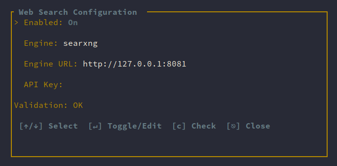

# Web Search

llm-manager can automatically search the web when your chat messages contain research-oriented keywords. Results are fetched via [SearXNG](https://github.com/searxng/searxng) and injected into the prompt before your message, allowing the LLM to cite sources and provide up-to-date information.

## Server-Side Flow

Web search runs **entirely on the llm-manager server**. External clients (chat frontends, curl, etc.) connect to llm-manager's API proxy (default port `49222`) just like any other chat request — no special headers or endpoints needed. The server intercepts chat completions requests, checks for search keywords, performs the SearXNG search, injects the results into the prompt, and forwards the enriched request to llama-server.

```
┌──────────┐     /v1/chat/completions      ┌──────────────────┐
│  Client  │ ──────────────────────────────►│ llm-manager API  │
│ (curl,   │ ◄──────────────────────────────│ proxy (port 49222)│
│  UI, etc)│     SSE streaming response     └────────┬─────────┘
└──────────┘                                        │
                                                    │ triggers SearXNG
                                                    ▼
                                           ┌──────────────────┐
                                           │   SearXNG        │
                                           │   instance       │
                                           └──────────────────┘
```

The `web_search_engine_url` config points to the **SearXNG instance**, not the client. Clients never need direct access to SearXNG — they only talk to llm-manager's API proxy.

## Trigger

Web search triggers when your message contains `$web`:

```
$web best model for coding 2026
$web compare qwen 3 and llama 4
$web recommend vision model
```

## Configuration

### Via Server Settings Panel

1. Open the **Server Settings** panel (press `F2` or `l` when focused)
2. Navigate to the **Web Search** field using arrow keys
3. Press `↵` (Enter) to open the Web Search Picker dialog

The dialog (65 columns wide, 15 rows tall) shows:

| Field | Type | Description |
|-------|------|-------------|
| **Enabled** | Toggle | Shows "On" (green) or "Off" (gray) — press `↵` to toggle |
| **Engine** | Dropdown | Search engine: `searxng` |
| **Engine URL** | Text input | URL of your SearXNG instance (e.g., `https://search.example.com`) |
| **API Key** | Text input | Bearer token for authentication (optional, masked as `****` when set) |

Navigation: `↑`/`↓` (or `j`/`k`) to move between fields, `↵` to toggle/edit, `⎋` (Esc) to close.

### Via config.yaml

Add these fields to your `~/.config/llm-manager/config.yaml`:

```yaml
default:
  web_search_enabled: true
  web_search_engine: searxng
  web_search_engine_url: "https://search.example.com"
  web_search_api_key: null  # optional, omit or set to null if not needed
```

### Per-Model Override

Web search settings can also be configured per-model in `~/.config/llm-manager/models/<model_name>.yaml`:

```yaml
web_search_enabled: true
web_search_engine: searxng
web_search_engine_url: "https://search.example.com"
web_search_api_key: null
```

Model-level settings override the global defaults.

## How It Works

When a message matches a trigger keyword:

1. **Query extraction** — the full user message is used as the search query
2. **SearXNG search** — HTTP GET request to `{engine_url}/search?q={query}&format=json`
3. **Result parsing** — expects JSON with a `results` array; each result needs `title`, `url`, and `content`/`snippet` fields
4. **Page fetching** — Wikipedia results and up to 5 other URLs have their page content fetched in parallel
5. **Context injection** — results are prepended to the message as a `[WEB CONTEXT]...[END WEB CONTEXT]` block

### Request Details

- **Endpoint:** `{engine_url}/search?q={url_encoded_query}&format=json`
- **User-Agent:** `Mozilla/5.0 (X11; Linux x86_64) AppleWebKit/537.36 (KHTML, like Gecko) Chrome/120.0.0.0 Safari/537.36`
- **Authentication:** `Authorization: Bearer {api_key}` header (only if `api_key` is configured)
- **Timeout:** 15 seconds
- **Max results:** 10

### Injected Prompt Format

The web context is prepended to the user message like this:

```
[WEB CONTEXT]
INSTRUCTION: Cite sources using inline markdown links in your answer.

## Search Results
1. **Title** - URL
   snippet text

## Web Context
## [Title](URL)
...fetched page content...

[END WEB CONTEXT]

[Original user message]
```

## Engine Support

| Engine | Status | Notes |
|--------|--------|-------|
| **SearXNG** | ✅ Fully functional | Requires a configured `engine_url` pointing to a SearXNG instance |

## SearXNG Setup



### Minimal `settings.yml`

SearXNG requires a `settings.yml` configuration file. Create one before deploying:

```yaml
use_default_settings: true

server:
  secret_key: "change-this-to-a-random-secret"  # generate with: python3 -c "import secrets; print(secrets.token_hex(32))"
  port: 8081
  bind_address: "0.0.0.0"
  # Base URL — required to avoid 303 redirects
  # Set to the public URL where SearXNG is accessible
  base_url: "http://localhost:8081"  # or "https://search.example.com"

search:
  default_lang: en
  # Enable JSON format for API access (required for llm-manager web search)
  formats:
    - html
    - json
```

> **Note:** The `server.port` in `settings.yml` is for SearXNG's WSGI metadata. The actual listening port is controlled by the `GRANIAN_PORT` environment variable (default `8080`). You must set `-e GRANIAN_PORT=8081` to match your desired port.

### Podman (standalone)

Run SearXNG as a standalone Podman container:

```bash
# Create config directory and settings file
mkdir -p ~/.searxng
cat > ~/.searxng/settings.yml << 'EOF'
use_default_settings: true

server:
  secret_key: "change-this-to-a-random-secret"
  port: 8081
  bind_address: "0.0.0.0"
  base_url: "http://localhost:8081"  # uncomment if behind reverse proxy

search:
  default_lang: en
  formats:
    - html
    - json
EOF

# Run the container
podman run -d \
  --name searxng \
  -p 8081:8081 \
  -e GRANIAN_PORT=8081 \
  -v ~/.searxng/settings.yml:/etc/searxng/settings.yml:Z \
  --restart unless-stopped \
  searxng/searxng:latest
```

> **Important:** Do **not** use `-v ~/.searxng:/etc/searxng/lib/searx:Z` — it replaces the entire Python package directory with an empty directory, causing the container to crash. Only mount the `settings.yml` file.

After deployment, use `http://localhost:8081` (or your public URL) as the Engine URL in llm-manager.

### Docker Compose

For Docker Compose users, create `docker-compose.yml`:

```yaml
services:
  searxng:
    image: searxng/searxng:latest
    ports:
      - "8081:8081"
    environment:
      - GRANIAN_PORT=8081
    volumes:
      - ~/.searxng/settings.yml:/etc/searxng/settings.yml:Z
    restart: unless-stopped
```

Run with:

```bash
docker compose up -d
```

### podman-compose

For `podman-compose` users:

```yaml
services:
  searxng:
    image: searxng/searxng:latest
    ports:
      - "8081:8081"
    environment:
      - GRANIAN_PORT=8081
    volumes:
      - ~/.searxng/settings.yml:/etc/searxng/settings.yml:Z
    restart: unless-stopped
```

Run with:

```bash
podman-compose up -d
```

## Settings Panel Display

The LLM Settings panel shows the current web search status:

```
Web Search (Enabled: searxng)
```
or
```
Web Search (Disabled: searxng)
```

## Troubleshooting

- **303 redirect** — set `server.base_url` in `settings.yaml` to the public URL (e.g., `http://localhost:8081` or `https://search.example.com`)
- **Search returns no results** — verify the Engine URL is accessible and points to a running SearXNG instance
- **Timeout errors** — web search has a 15-second timeout; slow SearXNG instances may need tuning
- **Authentication failures** — if `web_search_api_key` is set, ensure the SearXNG instance accepts the Bearer token
- **Results not appearing in chat** — check that trigger keywords are present in the message
- **HTTPS certificate errors** — ensure the SearXNG instance has valid TLS certificates if using `https://`
